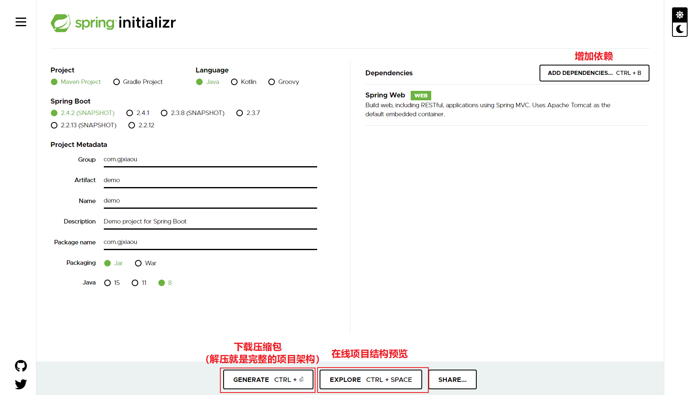
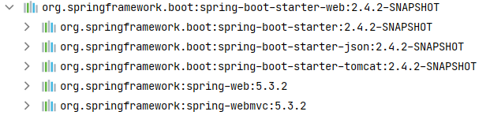

---
Time: 2020-12-13
Author: GJXAIOU
Mail: gjxaiou@gmail.com
Github Name: GJXAIOU
---

# Getting Started

If you are getting started with Spring Boot, or “Spring” in general, start by reading this section. It answers the basic “what?”, “how?” and “why?” questions. It includes an introduction to Spring Boot, along with installation instructions. We then walk you through building your first Spring Boot application, discussing some core principles as we go.

如果你开始使用 Spring Boot 或者是多数情况下的 「Spring」，可以从本章开始阅读。本章回答了基本的 「what」，「how」，「why」问题。包括了对 Spring Boot 的简介，安装说明。我们将一起搭建第一个 Spring Boot 应用，同时讨论一些核心原则。

## 1. Introducing Spring Boot（Spring Boot 简介）

<font color="#3498DB">**Spring Boot helps you to create stand-alone, production-grade Spring-based Applications that you can run**. </font>We take an opinionated view of the Spring platform and third-party libraries, so that you can get started with minimum fuss. Most Spring Boot applications need very little Spring configuration.

Spring Boot 可以帮助你创建一个你可以运行的基于 Spring 的应用，该应用是单体的，生产级别的。我们针对 Spring  平台和第三方库采用一种固执己见（较为通常）的视角，这样你可以以一种比较小的困扰开始。绝大部分的 Spring Boot 应用仅仅需要很少的 Spring  配置。

<font color="#3498DB">You can use Spring Boot to create Java applications that can be started by using `java -jar` or more traditional war deployments. We also provide a command line tool that runs “spring scripts”.</font>

你可以使用 Spring Boot 创建一个 Java 应用，它可以以 `java -jar` 方式启动（即 Jar 包），或者使用传统的 war 包形式部署。我们同时提供了一种命令行工具，只要执行 「spring scripts」。

> 补充：spring scripts 介绍和使用详见：https://docs.spring.io/spring-integration/docs/current/reference/html/scripting.html

Our primary goals are:

我们主要目标是：

- Provide a radically faster and widely accessible getting-started experience for all Spring development.
- 为所有的 Spring 开发提供一个非常快速并且广泛接收的入门经验。
- Be opinionated out of the box but get out of the way quickly as requirements start to diverge from the defaults.
- 开箱即用，但是当需求开始远离默认的时候快速远离这个方式。
- Provide a range of non-functional features that are common to large classes of projects (such as embedded servers, security, metrics, health checks, and externalized configuration).
- 提供大量的非功能性特征，这些在项目中的大量 class 中很常见。
- Absolutely no code generation and no requirement for XML configuration.
- 完全无代码生成或者不需要 XML 配置。

## 2. System Requirements（系统需求）

Spring Boot 2.4.2-SNAPSHOT requires [Java 8](https://www.java.com/) and is compatible（兼容） up to Java 15 (included). [Spring Framework 5.3.2](https://docs.spring.io/spring/docs/5.3.2/reference/html/) or above is also required.

Spring Boot 2.4.2-SHAPSHOT 需要 Java 8 语言支持，并且向上一直支持到 Java15（包括）。同时需要 [Spring Framework 5.3.2](https://docs.spring.io/spring/docs/5.3.2/reference/html/) 即以上版本支持。

Explicit（明确的） build support is provided for the following build tools:

下列构建工具提供了明确的构建支持：

| Build Tool | Version                                                      |
| :--------- | :----------------------------------------------------------- |
| Maven      | 3.3+                                                         |
| Gradle     | 6 (6.3 or later). 5.6.x is also supported but in a deprecated form |

> 注：查看安装的 Maven 版本号命令为：`mvn -version`，查看 Gradle 版本号命令为：`gradle -v`

### 2.1. Servlet Containers（Servlet 容器）

Spring Boot supports the following embedded servlet containers:

Spring  Boot 支持以下嵌入式的 Servlet 容器：

| Name         | Servlet Version |
| :----------- | :-------------- |
| Tomcat 9.0   | 4.0             |
| Jetty 9.4    | 3.1             |
| Undertow 2.0 | 4.0             |

You can also deploy Spring Boot applications to any Servlet 3.1+ compatible（兼容的） container.

你也可以将 Spring Boot 容器部署到任何兼容 Servlet 3.1+ 的容器中。

## 3. Installing Spring Boot（安装 Spring Boot）

Spring Boot can be used with “classic” Java development tools or installed as a command line tool. Either way, you need [Java SDK v1.8](https://www.java.com/) or higher. Before you begin, you should check your current Java installation by using the following command:

Spring Boot 可以作为 「经典的」Java 部署环境工具使用，或者作为命令行工具进行安装。无论哪种方式，你需要  Java SDK V1.8 或者更高的版本。在开始之前，你应该使用下面的命令检查你目前安装的 Java 版本。

```shell
$ java -version
```

If you are new to Java development or if you want to experiment with Spring Boot, you might want to try the [Spring Boot CLI](https://docs.spring.io/spring-boot/docs/2.4.2-SNAPSHOT/reference/html/getting-started.html#getting-started-installing-the-cli) (Command Line Interface) first. Otherwise, read on for “classic” installation instructions.

如果你是 Java 开发新手或者你想尝试使用 Spring Boot，你需要先尝试 [Spring Boot CLI](https://docs.spring.io/spring-boot/docs/2.4.2-SNAPSHOT/reference/html/getting-started.html#getting-started-installing-the-cli)（命令行接口）。否则，继续阅读 「经典的」安装说明。

### 3.1. Installation Instructions for the Java Developer（提供给 Java 开发者的安装说明）

You can use Spring Boot in the same way as any standard Java library. To do so, include the appropriate `spring-boot-*.jar` files on your classpath. Spring Boot does not require any special tools integration, so you can use any IDE or text editor. Also, there is nothing special about a Spring Boot application, so you can run and debug a Spring Boot application as you would any other Java program.

你可以像使用任何标准 Java 库一样使用 Spring Boot。做法如下，在你的 classpath 中引入 `spring-boot-*.jar` 的属性文件。Spring Boot 不需要任何特殊工具整合，因此你可以使用使用任何 IDE 或者文本编译器。同样，Spring Boot 没有什么特殊点，因此你可以像其它任何 Java 程序一样来运行和调试 Spring Boot 程序。

Although you could copy Spring Boot jars, we generally recommend that you use a build tool that supports dependency management (such as Maven or Gradle).

尽管你可以复制 Spring Boot 的 Jar 包，但是我们通常推荐您使用一个支持依赖管理的工具（例如 Maven 或者 Gradle）。

#### 3.1.1. Maven Installation（方式一：使用 Maven 安装）

Spring Boot is compatible with Apache Maven 3.3 or above. If you do not already have Maven installed, you can follow the instructions at [maven.apache.org](https://maven.apache.org/).

Spring Boot 与 Apache Maven 3.3 即以上版本兼容。如果你尚没有安装 Maven，可以参照 [maven.apache.org](https://maven.apache.org/) 里面的说明。

> On many operating systems, Maven can be installed with a package manager. If you use OSX Homebrew, try `brew install maven`. Ubuntu users can run `sudo apt-get install maven`. Windows users with [Chocolatey](https://chocolatey.org/) can run `choco install maven` from an elevated (administrator) prompt.
>
> 在很多操作系统中，Maven 可以以包管理的方式进行安装。如果使用 OSX 系统，可以使用 `brew install maven`。Ubuntu 用户可以使用 `sudo apt-get install maven`命令。

Spring Boot dependencies use the `org.springframework.boot` `groupId`. Typically, your Maven POM file inherits（继承） from the `spring-boot-starter-parent` project and declares dependencies to one or more [“Starters”](https://docs.spring.io/spring-boot/docs/2.4.2-SNAPSHOT/reference/html/using-spring-boot.html#using-boot-starter). Spring Boot also provides an optional [Maven plugin](https://docs.spring.io/spring-boot/docs/2.4.2-SNAPSHOT/reference/html/build-tool-plugins.html#build-tool-plugins-maven-plugin) to create executable jars.

Spring Boot 的依赖使用的 `groupId` 为 `org.springframework.boot`。通常你的 Maven POM 文件继承自 `spring-boot-starter-parent` 工程，该工程对一个或者多个 「[Starters]((https://docs.spring.io/spring-boot/docs/2.4.2-SNAPSHOT/reference/html/using-spring-boot.html#using-boot-starter))」声明依赖，Spring Boot 同时提供了一个可选的 [Maven 插件](https://docs.spring.io/spring-boot/docs/2.4.2-SNAPSHOT/reference/html/build-tool-plugins.html#build-tool-plugins-maven-plugin) 来创建可执行的 Jar 包。

> 注：1.Starters 的详细使用说明见文档：Using Spring Boot 的 1.5.Starters
>
> 2.Maven 插件的详细使用说明见文档：Build Tool Plugins 的  1. Spring Boot Maven Plugin

More details on getting started with Spring Boot and Maven can be found in the [Getting Started section](https://docs.spring.io/spring-boot/docs/2.4.2-SNAPSHOT/maven-plugin/reference/htmlsingle/#getting-started) of the Maven plugin’s reference guide.

关于 Spring Boot 和 Maven 的启动细节详见参考文档：Maven Plugin’s 参考文档的 [Getting Started section](https://docs.spring.io/spring-boot/docs/2.4.2-SNAPSHOT/maven-plugin/reference/htmlsingle/#getting-started) 。

> 注：本质上就是上面 Build Tool Plugins 的  1. Spring Boot Maven Plugin 的 HTML 详解文档。

#### 3.1.2. Gradle Installation（方式二：使用 Gradle 安装）

Spring Boot is compatible with Gradle 6 (6.3 or later). Gradle 5.6.x is also supported but this support is deprecated and will be removed in a future release. If you do not already have Gradle installed, you can follow the instructions at [gradle.org](https://gradle.org/).

Spring Boot dependencies can be declared by using the `org.springframework.boot` `group`. Typically, your project declares dependencies to one or more [“Starters”](https://docs.spring.io/spring-boot/docs/2.4.2-SNAPSHOT/reference/html/using-spring-boot.html#using-boot-starter). Spring Boot provides a useful [Gradle plugin](https://docs.spring.io/spring-boot/docs/2.4.2-SNAPSHOT/reference/html/build-tool-plugins.html#build-tool-plugins-gradle-plugin) that can be used to simplify dependency declarations and to create executable jars.

> ​                                                                                  Gradle Wrapper
>
> The Gradle Wrapper provides a nice way of “obtaining” Gradle when you need to build a project. It is a small script and library that you commit alongside your code to bootstrap the build process. See [docs.gradle.org/current/userguide/gradle_wrapper.html](https://docs.gradle.org/current/userguide/gradle_wrapper.html) for details.

More details on getting started with Spring Boot and Gradle can be found in the [Getting Started section](https://docs.spring.io/spring-boot/docs/2.4.2-SNAPSHOT/gradle-plugin/reference/htmlsingle/#getting-started) of the Gradle plugin’s reference guide.

### 3.2. Installing the Spring Boot CLI（安装 Spring Boot CLI）

The Spring Boot CLI (Command Line Interface) is a command line tool that you can use to quickly prototype （原型）with Spring. It lets you run [Groovy](https://groovy-lang.org/) scripts, which means that you have a familiar Java-like syntax （语法）without so much boilerplate（样板） code.

Spring Boot CLI（命令行接口）是一个可以用于快速创建 Spring 原型的命令行工具。它可以让你使用 [Groovy](https://groovy-lang.org/) 脚本，这意味它与 Java 语法相似并且没有太多的样板代码。

You do not need to use the CLI to work with Spring Boot, but it is definitely the quickest way to get a Spring application off the ground.

你不必使用 CLI 来处理 Spring Boot。但是它无疑是开启一个 Spring 应用的最快速的方式。 

#### 3.2.1. Manual Installation（安装手册）

You can download the Spring CLI distribution from the Spring software repository:

你可以从 Spring 软件库中下载 Spring CLI 的发行版。

- [spring-boot-cli-2.4.2-SNAPSHOT-bin.zip](https://repo.spring.io/snapshot/org/springframework/boot/spring-boot-cli/2.4.2-SNAPSHOT/spring-boot-cli-2.4.2-SNAPSHOT-bin.zip)
- [spring-boot-cli-2.4.2-SNAPSHOT-bin.tar.gz](https://repo.spring.io/snapshot/org/springframework/boot/spring-boot-cli/2.4.2-SNAPSHOT/spring-boot-cli-2.4.2-SNAPSHOT-bin.tar.gz)

Cutting edge [snapshot distributions](https://repo.spring.io/snapshot/org/springframework/boot/spring-boot-cli/) are also available.

Once downloaded, follow the [INSTALL.txt](https://raw.githubusercontent.com/spring-projects/spring-boot/master/spring-boot-project/spring-boot-cli/src/main/content/INSTALL.txt) instructions from the unpacked archive. In summary, there is a `spring` script (`spring.bat` for Windows) in a `bin/` directory in the `.zip` file. Alternatively（另外）, you can use `java -jar` with the `.jar` file (the script helps you to be sure that the classpath is set correctly).

下载之后，遵循解压之后的 [INSTALL.txt](https://raw.githubusercontent.com/spring-projects/spring-boot/master/spring-boot-project/spring-boot-cli/src/main/content/INSTALL.txt) 的说明。总而言之，在 `.zip` 文件中的 `bin/` 目录下有一个 `Spring` 脚本（对 Window 就是 `spring.bat`）。另外，你可以对 `.jar` 文件使用 `java -jar`（这个脚本帮助你确认设置的 classpath 是正确的）、

#### 3.2.2. Installation with SDKMAN!（安装 SDKMAN!）

SDKMAN! (The Software Development Kit Manager) can be used for managing multiple versions of various binary SDKs, including Groovy and the Spring Boot CLI. Get SDKMAN! from [sdkman.io](https://sdkman.io/) and install Spring Boot by using the following commands:

SDKMAN!（软件开发套件管理）可以用于管理不同二进制 SDK 的不同版本。包括 Groovy 和 Spring Boot CLI。从  [sdkman.io](https://sdkman.io/) 下载 SDKMAN! 之后使用下面命令来安装 Spring Boot。

```shell
$ sdk install springboot
$ spring --version
Spring Boot v2.4.2-SNAPSHOT
```

If you develop features for the CLI and want access to the version you built, use the following commands:

如果你为 CLI 开发功能并且希望访问你构建的版本，可以使用下面命令：

```shell
$ sdk install springboot dev /path/to/spring-boot/spring-boot-cli/target/spring-boot-cli-2.4.2-SNAPSHOT-bin/spring-2.4.2-SNAPSHOT/
$ sdk default springboot dev
$ spring --version
Spring CLI v2.4.2-SNAPSHOT
```

The preceding instructions install a local instance of `spring` called the `dev` instance. It points at your target build location, so every time you rebuild Spring Boot, `spring` is up-to-date.

上面指令安装了一个叫 `dev` 的 `Spring` 实例。它指向你的目标构建位置，所以每次重新构建 Spring Boot 时， `Spring` 会升级到最新。

You can see it by running the following command:

你可以通过运行下面命令来查看：

```shell
$ sdk ls springboot

================================================================================
Available Springboot Versions
================================================================================
> + dev
* 2.4.2-SNAPSHOT

================================================================================
+ - local version
* - installed
> - currently in use
================================================================================
```

#### 3.2.3. OSX Homebrew Installation（OSX 使用 Homebrew 安装）

If you are on a Mac and use [Homebrew](https://brew.sh/), you can install the Spring Boot CLI by using the following commands:

如果你是 Mac 设备并且使用 [Homebrew](https://brew.sh/)，你可以通过下列命令来安装 Spring Boot CLI。

```shell
$ brew tap pivotal/tap
$ brew install springboot
```

Homebrew installs `spring` to `/usr/local/bin`.

>If you do not see the formula, your installation of brew might be out-of-date. In that case, run `brew update` and try again.
>
>如果你没有看到上述结果，你安装的 brew 可能版本有点过时。如果是这种情况，可以先执行 `brew updata` 升级 brew 然后再次尝试。

#### 3.2.4. MacPorts Installation（使用 MacPorts 安装）

If you are on a Mac and use [MacPorts](https://www.macports.org/), you can install the Spring Boot CLI by using the following command:

如果你是 Mac 设备并且使用  [MacPorts](https://www.macports.org/)，你可以通过下列命令来安装 Spring Boot CLI。

```shell
$ sudo port install spring-boot-cli
```

#### 3.2.5. Command-line Completion（命令行完成）

The Spring Boot CLI includes scripts that provide command completion for the [BASH](https://en.wikipedia.org/wiki/Bash_(Unix_shell)) and [zsh](https://en.wikipedia.org/wiki/Z_shell) shells. You can `source` the script (also named `spring`) in any shell or put it in your personal or system-wide bash completion initialization. On a Debian system, the system-wide scripts are in `/shell-completion/bash` and all scripts in that directory are executed when a new shell starts. For example, to run the script manually（手动） if you have installed by using SDKMAN!, use the following commands:

Spring Boot CLI 中的脚本针对 [BASH](https://en.wikipedia.org/wiki/Bash_(Unix_shell)) 和[zsh](https://en.wikipedia.org/wiki/Z_shell)提供了命令行完成方式，你可以在任何 shell 中使用 `source` 执行该脚本（同样名称为 `spring`）或者在将其放入个人用户或系统层面的 bash 来完成初始化。在 Debian 系统中，系统层面的脚本在 `/shell-completion/bash` 目录下，并且当一个新的 shell 启动的时候该目录下所有脚本都会被执行。例如，如果要手动运行一个已经通过 SDKMAIN! 安装的脚本，可以使用下列命令：

```shell
$ . ~/.sdkman/candidates/springboot/current/shell-completion/bash/spring
$ spring <HIT TAB HERE>
  grab  help  jar  run  test  version
```

> If you install the Spring Boot CLI by using Homebrew or MacPorts, the command-line completion scripts are automatically registered with your shell.
>
> 如果你通过 Homebrew 或者 MacPorts 安装 Spring Boot CLI，命令行完成脚本会自动注册到你的 shell 中。

#### 3.2.6. Windows Scoop Installation（Window 使用 Scoop 安装）

If you are on a Windows and use [Scoop](https://scoop.sh/), you can install the Spring Boot CLI by using the following commands:

如果你是 Windows 设备并且使用  [Scoop](https://scoop.sh/)，你可以通过下列命令来安装 Spring Boot CLI。

> 注：Scoop 安装参考：https://github.com/lukesampson/scoop/wiki/Quick-Start

```shell
> scoop bucket add extras
> scoop install springboot 
```

Scoop installs `spring` to `~/scoop/apps/springboot/current/bin`.

Scoop 将 `spring` 安装到 `~/scoop/apps/springboot/current/bin` 目录下。

>If you do not see the app manifest（显示）, your installation of scoop might be out-of-date. In that case, run `scoop update` and try again.
>
>如果你没有看到 app  显示，你安装的 scoop 可能过时了，这种情况下，先使用 `scoop update` 进行升级然后再次尝试。

#### 3.2.7. Quick-start Spring CLI Example（快速入门 Spring CLI 示例）

You can use the following web application to test your installation. To start, create a file called `app.groovy`, as follows:

你可以使用下面的 web 程序来检查你的安装是否正确，首先创建一个 `app.groovy` 文件，内容如下：

```groovy
@RestController
class ThisWillActuallyRun {

    @RequestMapping("/")
    String home() {
        "Hello World!"
    }
}
```

Then run it from a shell, as follows:

然后使用下面命令在 shell 中运行它。

```shell
$ spring run app.groovy
```

>The first run of your application is slow, as dependencies are downloaded. Subsequent runs are much quicker.
>
>因为依赖需要下载，所以第一次运行你的程序会有点慢，后续运行会比较快。

Open `localhost:8080` in your favorite web browser. You should see the following output:

> 在 web 浏览器中输入 `localhost:8080`，你应该看到如下输出。

```
Hello World!
```

### 3.3. Upgrading from an Earlier Version of Spring Boot（从 Spring Boot 早期版本进行升级）

If you are upgrading from the `1.x` release of Spring Boot, check the [“migration guide” on the project wiki](https://github.com/spring-projects/spring-boot/wiki/Spring-Boot-2.0-Migration-Guide) that provides detailed upgrade instructions. Check also the [“release notes”](https://github.com/spring-projects/spring-boot/wiki) for a list of “new and noteworthy” features for each release.

如果你是从 Spring Boot 的 `1.x` 发行版本进行升级，文档  [“migration guide” on the project wiki](https://github.com/spring-projects/spring-boot/wiki/Spring-Boot-2.0-Migration-Guide) 提供了详细的升级指导，同时通过查看  [“release notes”](https://github.com/spring-projects/spring-boot/wiki) 来查看一系列相比原版本 「新的并且显著的」的特征。

When upgrading to a new feature release, some properties may have been renamed or removed. Spring Boot provides a way to analyze your application’s environment and print diagnostics（诊断） at startup, but also temporarily（暂时性） migrate（迁移） properties at runtime for you. To enable that feature, add the following dependency to your project:

当升级到一个新的主版本，某些属性可能已经重命名或者移除了。Spring Boot 提供了一种方式去分析你的应用环境并且打印启动时的诊断数据，同时可以在运行时暂时性的迁移属性。为了确保上述的实现，需要将下面依赖增加到你的工程中。

```xml
<dependency>
    <groupId>org.springframework.boot</groupId>
    <artifactId>spring-boot-properties-migrator</artifactId>
    <scope>runtime</scope>
</dependency>
```

> Properties that are added late to the environment, such as when using `@PropertySource`, will not be taken into account.
>
> 延迟添加到环境中的属性，例如当使用 `@PropertySource` 时，该属性将不会别考虑在内。

> Once you’re done with the migration, please make sure to remove this module from your project’s dependencies.
>
> 完成迁移后，请确保从项目的依赖项中删除此模块。

To upgrade an existing CLI installation, use the appropriate package manager command (for example, `brew upgrade`). If you manually installed the CLI, follow the [standard instructions](https://docs.spring.io/spring-boot/docs/2.4.2-SNAPSHOT/reference/html/getting-started.html#getting-started-manual-cli-installation), remembering to update your `PATH` environment variable to remove any older references.

为了升级已存在的 CLI 安装，需要使用合适的包管理命令（例如，`brew upgrade`）。如果你手动安装了 CLI，请遵从 [standard instructions](https://docs.spring.io/spring-boot/docs/2.4.2-SNAPSHOT/reference/html/getting-started.html#getting-started-manual-cli-installation) 文档，记住更新「PATH」环境变量以删除任何旧的引用。

## 4. Developing Your First Spring Boot Application（开发第一个 Spring Boot 应用）

This section describes how to develop a small “Hello World!” web application that highlights some of Spring Boot’s key features. We use Maven to build this project, since most IDEs support it.

该部分描述了如何创建一个小的 「Hello World!」 web 程序，该程序可以突出 Spring Boot 的一些主要特征，我们使用 Maven 来构建这个项目，因为大多数 IDE 都支持它。

> The [spring.io](https://spring.io/) web site contains many “Getting Started” [guides](https://spring.io/guides) that use Spring Boot. If you need to solve a specific problem, check there first. You can shortcut the steps below by going to [start.spring.io](https://start.spring.io/) and choosing the "Web" starter from the dependencies searcher. Doing so generates a new project structure so that you can [start coding right away](https://docs.spring.io/spring-boot/docs/2.4.2-SNAPSHOT/reference/html/getting-started.html#getting-started-first-application-code). Check the [Spring Initializr documentation](https://docs.spring.io/initializr/docs/current/reference/html/#user-guide) for more details.
>
> [spring.io](https://spring.io/) 网站包括很多有关使用 Spring Boot 的「Getting Started」[guides](https://spring.io/guides)。如果你需要解决一个特定的问题可以先查看它。你通过  [start.spring.io](https://start.spring.io/) 并且从依赖选择器中选择 「Web」启动器来快捷的使用下面步骤。这样做会生成一个新的项目结构，你就可以 [立刻开始编码](https://docs.spring.io/spring-boot/docs/2.4.2-SNAPSHOT/reference/html/getting-started.html#getting-started-first-application-code)，查看 [Spring Initializr documentation](https://docs.spring.io/initializr/docs/current/reference/html/#user-guide) 可以了解更多详细信息。

> 注：[start.spring.io](https://start.spring.io/) 可以快速创建一个 Spring Boot 项目，下载之后是压缩包，解压之后就是完整的项目结构，网页页面如下：
>
> 

Before we begin, open a terminal and run the following commands to ensure that you have valid versions of Java and Maven installed:

在我们开始之前，我们开启一个控制台并且执行以下命令以确定已经安装了符合的 Java 和 Maven 版本。

```shell
$ java -version
java version "1.8.0_102"
Java(TM) SE Runtime Environment (build 1.8.0_102-b14)
Java HotSpot(TM) 64-Bit Server VM (build 25.102-b14, mixed mode)
```

```shell
$ mvn -v
Apache Maven 3.5.4 (1edded0938998edf8bf061f1ceb3cfdeccf443fe; 2018-06-17T14:33:14-04:00)
Maven home: /usr/local/Cellar/maven/3.3.9/libexec
Java version: 1.8.0_102, vendor: Oracle Corporation
```

> This sample needs to be created in its own directory. Subsequent instructions assume that you have created a suitable directory and that it is your current directory.
>
>这个示例需要在自身目录下创建，后续步骤假设你已经创建了一个合适的目录，并且就是你现在的目录。

### 4.1. Creating the POM（创建 POM 文件）

We need to start by creating a Maven `pom.xml` file. The `pom.xml` is the recipe（配方） that is used to build your project. Open your favorite text editor and add the following:

我们从创建一个 Maven 的 `pom.xml` 文件开始，这个 `pom.xml` 是构建你项目的配方。使用任意文本编辑器然后增加以下内容：

```xml
<?xml version="1.0" encoding="UTF-8"?>
<project xmlns="http://maven.apache.org/POM/4.0.0" xmlns:xsi="http://www.w3.org/2001/XMLSchema-instance"
    xsi:schemaLocation="http://maven.apache.org/POM/4.0.0 https://maven.apache.org/xsd/maven-4.0.0.xsd">
    <modelVersion>4.0.0</modelVersion>

    <groupId>com.example</groupId>
    <artifactId>myproject</artifactId>
    <version>0.0.1-SNAPSHOT</version>

    <parent>
        <groupId>org.springframework.boot</groupId>
        <artifactId>spring-boot-starter-parent</artifactId>
        <version>2.4.2-SNAPSHOT</version>
    </parent>

    <description/>
    <developers>
        <developer/>
    </developers>
    <licenses>
        <license/>
    </licenses>
    <scm>
        <url/>
    </scm>
    <url/>

    <!-- Additional lines to be added here... -->

    <!-- (you don't need this if you are using a .RELEASE version) -->
    <repositories>
        <repository>
            <id>spring-snapshots</id>
            <url>https://repo.spring.io/snapshot</url>
            <snapshots><enabled>true</enabled></snapshots>
        </repository>
        <repository>
            <id>spring-milestones</id>
            <url>https://repo.spring.io/milestone</url>
        </repository>
    </repositories>
    <pluginRepositories>
        <pluginRepository>
            <id>spring-snapshots</id>
            <url>https://repo.spring.io/snapshot</url>
        </pluginRepository>
        <pluginRepository>
            <id>spring-milestones</id>
            <url>https://repo.spring.io/milestone</url>
        </pluginRepository>
    </pluginRepositories>
</project>
```

The preceding listing should give you a working build. You can test it by running `mvn package` (for now, you can ignore the “jar will be empty - no content was marked for inclusion!” warning).

上述列表应该给出了工作构建。你可以通过运行 `mvn package`（目前，你可以忽略 「jar will be empty - no content was marked for inclusion!」警告）来进行测试。

> At this point, you could import the project into an IDE (most modern Java IDEs include built-in support for Maven). For simplicity, we continue to use a plain text editor for this example.
>
> 此时，你应该将你的工程导入一个 IDE（绝大多数的 Java IDE 都包括对 Maven 的内置支持），为了简单，这个例子中我们继续使用一个简易的文本编译器。

### 4.2. Adding Classpath Dependencies（增加类路径依赖）

Spring Boot provides a number of “Starters” that let you add jars to your classpath. Our applications for smoke tests use the `spring-boot-starter-parent` in the `parent` section of the POM. The `spring-boot-starter-parent` is a special starter that provides useful Maven defaults. It also provides a [`dependency-management`](https://docs.spring.io/spring-boot/docs/2.4.2-SNAPSHOT/reference/html/using-spring-boot.html#using-boot-dependency-management) section so that you can omit（省略） `version` tags for “blessed” dependencies.

Spring Boot 提供了大量的 「Starters」，可以将 Jar 包增加到类路径中。为了我们程序的冒烟测试，在 POM 文件的 `parent` 部分使用了 `spring-boot-starter-parent`。<font color="#3498DB">`spring-boot-starter-parent`是一个提供有用的 Maven 默认值的特殊启动器。它同时提供了 `dependency-management` 部分，因此你可以对 「有福了的」依赖省略 `version` 标签。</font>

Other “Starters” provide dependencies that you are likely to need when developing a specific type of application. Since we are developing a web application, we add a `spring-boot-starter-web` dependency. Before that, we can look at what we currently have by running the following command:

其它 「启动器」提供了当开发一个特定类型的应用时你可能需要的依赖，因为我们开发的是一个 web 项目，我们需要 `spring-boot-starter-web` 依赖。在此之前我们通过以下命令看看我们目前正在运行的依赖。	

```
$ mvn dependency:tree

[INFO] com.example:myproject:jar:0.0.1-SNAPSHOT
```

> 注：上述命令需要在项目的 pom.xml 文件同目录下运行。

The `mvn dependency:tree` command prints a tree representation of your project dependencies. You can see that `spring-boot-starter-parent` provides no dependencies by itself. To add the necessary dependencies, edit your `pom.xml` and add the `spring-boot-starter-web` dependency immediately below the `parent` section:

`mvn dependency:tree`命令会打印一棵代表你项目依赖的树，你可以看到 `spring-boot-starter-parent` 除了自身没有提供任何依赖。为了增加必要的依赖，在 `pom.xml` 文件中在 `parent`部分下面添加 `spring-boot-starter-web` 依赖。

```xml
<dependencies>
    <dependency>
        <groupId>org.springframework.boot</groupId>
        <artifactId>spring-boot-starter-web</artifactId>
    </dependency>
</dependencies>
```

If you run `mvn dependency:tree` again, you see that there are now a number of additional dependencies, including the Tomcat web server and Spring Boot itself.

如果你再次运行 `mvn dependency:tree`，你可以看到现在有很多附加的依赖关系，包括 Tomcat 服务器和 Spring Boot 自身。

> 注：再次运行结果（简化和详细）如下：
>
> 
>
> [INFO]
> [INFO] --- maven-dependency-plugin:3.1.2:tree (default-cli) @ GettingStarted ---
> [INFO] com.gjxaiou:GettingStarted:jar:1.0-SNAPSHOT
> [INFO] \- org.springframework.boot:spring-boot-starter-web:jar:2.4.2-SNAPSHOT:compile
> [INFO]    +- org.springframework.boot:spring-boot-starter:jar:2.4.2-SNAPSHOT:compile
> [INFO]    |  +- org.springframework.boot:spring-boot:jar:2.4.2-SNAPSHOT:compile
> [INFO]    |  +- org.springframework.boot:spring-boot-autoconfigure:jar:2.4.2-SNAPSHOT:compile
> [INFO]    |  +- org.springframework.boot:spring-boot-starter-logging:jar:2.4.2-SNAPSHOT:compile
> [INFO]    |  |  +- ch.qos.logback:logback-classic:jar:1.2.3:compile
> [INFO]    |  |  |  +- ch.qos.logback:logback-core:jar:1.2.3:compile
> [INFO]    |  |  |  \- org.slf4j:slf4j-api:jar:1.7.30:compile
> [INFO]    |  |  +- org.apache.logging.log4j:log4j-to-slf4j:jar:2.13.3:compile
> [INFO]    |  |  |  \- org.apache.logging.log4j:log4j-api:jar:2.13.3:compile
> [INFO]    |  |  \- org.slf4j:jul-to-slf4j:jar:1.7.30:compile
> [INFO]    |  +- jakarta.annotation:jakarta.annotation-api:jar:1.3.5:compile
> [INFO]    |  +- org.springframework:spring-core:jar:5.3.2:compile
> [INFO]    |  |  \- org.springframework:spring-jcl:jar:5.3.2:compile
> [INFO]    |  \- org.yaml:snakeyaml:jar:1.27:compile
> [INFO]    +- org.springframework.boot:spring-boot-starter-json:jar:2.4.2-SNAPSHOT:compile
> [INFO]    |  +- com.fasterxml.jackson.core:jackson-databind:jar:2.11.3:compile
> [INFO]    |  |  +- com.fasterxml.jackson.core:jackson-annotations:jar:2.11.3:compile
> [INFO]    |  |  \- com.fasterxml.jackson.core:jackson-core:jar:2.11.3:compile
> [INFO]    |  +- com.fasterxml.jackson.datatype:jackson-datatype-jdk8:jar:2.11.3:compile
> [INFO]    |  +- com.fasterxml.jackson.datatype:jackson-datatype-jsr310:jar:2.11.3:compile
> [INFO]    |  \- com.fasterxml.jackson.module:jackson-module-parameter-names:jar:2.11.3:compile
> [INFO]    +- org.springframework.boot:spring-boot-starter-tomcat:jar:2.4.2-SNAPSHOT:compile
> [INFO]    |  +- org.apache.tomcat.embed:tomcat-embed-core:jar:9.0.41:compile
> [INFO]    |  +- org.glassfish:jakarta.el:jar:3.0.3:compile
> [INFO]    |  \- org.apache.tomcat.embed:tomcat-embed-websocket:jar:9.0.41:compile
> [INFO]    +- org.springframework:spring-web:jar:5.3.2:compile
> [INFO]    |  \- org.springframework:spring-beans:jar:5.3.2:compile
> [INFO]    \- org.springframework:spring-webmvc:jar:5.3.2:compile
> [INFO]       +- org.springframework:spring-aop:jar:5.3.2:compile
> [INFO]       +- org.springframework:spring-context:jar:5.3.2:compile
> [INFO]       \- org.springframework:spring-expression:jar:5.3.2:compile
> [INFO] ------------------------------------------------------------------------

### 4.3. Writing the Code（编写代码）

To finish our application, we need to create a single Java file. By default, Maven compiles sources from `src/main/java`, so you need to create that directory structure and then add a file named `src/main/java/Example.java` to contain the following code:

为了完成我们的应用，我们需要编写一个单独的 Java 文件。默认情况下， Maven 从 `src/main/java` 下编译源代码，因此你需要创建上述的目录结构并且添加一个文件并命名为：`src/main/java/Example.java` ，文件中包括以下代码。

```java
import org.springframework.boot.*;
import org.springframework.boot.autoconfigure.*;
import org.springframework.web.bind.annotation.*;

@RestController
@EnableAutoConfiguration
public class Example {

    @RequestMapping("/")
    String home() {
        return "Hello World!";
    }

    public static void main(String[] args) {
        SpringApplication.run(Example.class, args);
    }

}
```

Although there is not much code here, quite a lot is going on. We step through the important parts in the next few sections.

尽管这里代码不多，后续比较多，我们将在接下来的几节中详细介绍重要的部分。

#### 4.3.1. The @RestController and @RequestMapping Annotations（@RestController 和 @ RequestMapping 声明）

The first annotation on our `Example` class is `@RestController`. This is known as a *stereotype* annotation. It provides hints（提示） for people reading the code and for Spring that the class plays a specific role. In this case, our class is a web `@Controller`, so Spring considers it when handling incoming web requests.

在 `Example` 类上的第一个声明就是 `@RestController`，即所谓的原型注解。它为阅读代码的提供了一个提示，同时表示该类在 Spring 中扮演一个特殊的角色。在本示例中，我们的类是一个 web `@Controller` ，因此当处理传入的 web 请求时候 Spring 会考虑这个类。 		

The `@RequestMapping` annotation provides “routing” information. It tells Spring that any HTTP request with the `/` path should be mapped to the `home` method. The `@RestController` annotation tells Spring to render（提供） the resulting string directly back to the caller.

`@RequestMapping` 注解提供了「路径」信息，它告知 Spring，任何 `/` 路径下的 HTTP 请求都应该被映射到 `home` 方法，`@RestController`注解告诉 Spring 将返回结果字符串直接提交给调用者。

> The `@RestController` and `@RequestMapping` annotations are Spring MVC annotations (they are not specific to Spring Boot). See the [MVC section](https://docs.spring.io/spring/docs/5.3.2/reference/html/web.html#mvc) in the Spring Reference Documentation for more details.
>
> `@RestController` 和 `@RequestMapping` 注解都是 Spring MVC 的注解（它们并不是指针对于 Spring Boot）。可以查看 Spring 参考文档的  [MVC section](https://docs.spring.io/spring/docs/5.3.2/reference/html/web.html#mvc) 了解更多细节。

#### 4.3.2. The @EnableAutoConfiguration Annotation（@EnableAutoConfiguration 注解）

The second class-level annotation is `@EnableAutoConfiguration`. This annotation tells Spring Boot to “guess” how you want to configure Spring, based on the jar dependencies that you have added. Since `spring-boot-starter-web` added Tomcat and Spring MVC, the auto-configuration assumes that you are developing a web application and sets up Spring accordingly.

第二个类级别的注解是 `@EnableAutoConfiguration`。这个注解告诉 Spring Boot 你已经添加的 Jar 包来 「猜测」你想如何配置 Spring。因为 `spring-boot-starter-web` 增加了 Tomcat 和 Spring MVC 依赖，自动配置就会假设你正在开发一个 web 应用并且对应的配置 Spring。

> ​																	Starters and Auto-configuration
>
> Auto-configuration is designed to work well with “Starters”, but the two concepts are not directly tied. You are free to pick and choose jar dependencies outside of the starters. Spring Boot still does its best to auto-configure your application.
>
> 自动配置被设置成与 「Starter」可以良好运行，但是这两个概念并没有直接的关联在一起。你可以在 starter 之外自由选择 Jar 包依赖项。Spring Boot 仍会尽力自动配置你的应用。

#### 4.3.3. The “main” Method（「main」方法）

The final part of our application is the `main` method. This is a standard method that follows the Java convention for an application entry point. Our main method delegates（代表，委托） to Spring Boot’s `SpringApplication` class by calling `run`. `SpringApplication` bootstraps（引导）our application , starting Spring, which, in turn, starts the auto-configured Tomcat web server. We need to pass `Example.class` as an argument to the `run` method to tell `SpringApplication` which is the primary Spring component. The `args` array is also passed through to expose any command-line arguments.

我们应用的最后一部分是 `main` 方法，这是一个标准方法，它遵循应用程序入口点的 Java 约定。我们的main 方法通过调用 `run`委托给了 Spring Boot 的 `SpringApplication`类。`SpringApplication`按照顺序引导我们的应用程序，启动 Spring，然后启动自动配置的 Tomcat web服务器。我们需要通过 `Example.class` 作为 `run` 方法的参数来告诉 `SpringApplication`哪一个是主要的 Spring 组件。`args` 数组同时也被传递来暴露任何命令行参数。

### 4.4. Running the Example（运行这个示例）

At this point, your application should work. Since you used the `spring-boot-starter-parent` POM, you have a useful `run` goal that you can use to start the application. Type `mvn spring-boot:run` from the root project directory to start the application. You should see output similar to the following:

此时，你的应用程序应该可以工作了，因为你使用了 `spring-boot-starter-parent` POM，你拥有了一个可以用于启动程序的有用的 `run` 目标。在项目的根目录下使用 `mvn spring-boot:run` 启动该应用。你应该会看到类似下面的输出：

```shell
$ mvn spring-boot:run

  .   ____          _            __ _ _
 /\\ / ___'_ __ _ _(_)_ __  __ _ \ \ \ \
( ( )\___ | '_ | '_| | '_ \/ _` | \ \ \ \
 \\/  ___)| |_)| | | | | || (_| |  ) ) ) )
  '  |____| .__|_| |_|_| |_\__, | / / / /
 =========|_|==============|___/=/_/_/_/
 :: Spring Boot ::  (v2.4.2-SNAPSHOT)
....... . . .
....... . . . (log output here)
....... . . .
........ Started Example in 2.222 seconds (JVM running for 6.514)
```

If you open a web browser to `localhost:8080`, you should see the following output:

如果你开启一个浏览器并输入 `localhost:8080`，你应该会看到如下输出：

```
Hello World!
```

To gracefully exit the application, press `ctrl-c`.

如果想优雅的退出该程序，使用 `ctrl-c`

### 4.5. Creating an Executable Jar（创建一个可执行的 Jar 包）

We finish our example by creating a completely self-contained executable jar file that we could run in production. Executable jars (sometimes called “fat jars”) are archives（存档） containing your compiled classes along with all of the jar dependencies that your code needs to run.

我们通过创建一个完全自包含的可执行 Jar 包来结束我们的示例，该 Jar 包可以在生产环境中运行。可执行的 Jar（通常也称为 「fat jars」）是一种归档文件，其中包括编译后的类和代码运行所必须的所有 Jar 包依赖。

> ​																			Executable jars and Java
>
> Java does not provide a standard way to load nested jar files (jar files that are themselves contained within a jar). This can be problematic if you are looking to distribute a self-contained application.
>
> Java 没有提供加载内嵌 jar 文件的标准化方式（jar 文件就是指他们自身被包含在另一个 jar 中）。如果你希望发布一个自包含的应用程序可能就会有问题。
>
> To solve this problem, many developers use “uber” jars. An uber jar packages all the classes from all the application’s dependencies into a single archive. The problem with this approach is that it becomes hard to see which libraries are in your application. It can also be problematic if the same filename is used (but with different content) in multiple jars. 
>
> 为了解决这个问题，许多开发者使用 「uber」Jar 。Uber Jar 将所有应用程序依赖的类打包到一个 jar 包中。这种方案的问题是很难在你的应用中看到包含哪些库，同样连一个问题是，在不同 jar 包中可能有相同的文件名称（但是内容不同）。
>
> Spring Boot takes a [different approach](https://docs.spring.io/spring-boot/docs/2.4.2-SNAPSHOT/reference/html/appendix-executable-jar-format.html#executable-jar) and lets you actually nest jars directly.
>
> Spring Boot 采用了一种  [不同的方式](https://docs.spring.io/spring-boot/docs/2.4.2-SNAPSHOT/reference/html/appendix-executable-jar-format.html#executable-jar) 使你可以直接内嵌 jar 包。

To create an executable jar, we need to add the `spring-boot-maven-plugin` to our `pom.xml`. To do so, insert the following lines just below the `dependencies` section:

为了创建一个可执行的 jar，我们需要在 `pom.xml` 中添加 `spring-boot-maven-plugin`。为此，请在 `dependencies` 部分添加以下内容。

```xml
<build>
    <plugins>
        <plugin>
            <groupId>org.springframework.boot</groupId>
            <artifactId>spring-boot-maven-plugin</artifactId>
        </plugin>
    </plugins>
</build>
```

> The `spring-boot-starter-parent` POM includes `<executions>` configuration to bind the `repackage` goal. If you do not use the parent POM, you need to declare this configuration yourself. See the [plugin documentation](https://docs.spring.io/spring-boot/docs/2.4.2-SNAPSHOT/maven-plugin/reference/htmlsingle/#getting-started) for details.
>
> `spring-boot-starter-parent` POM 包括绑定 `repackage` 目标的 `<executions>` 配置。如果你没有使用父 POM，你需要自己声明这个配置。可以查看 [plugin documentation](https://docs.spring.io/spring-boot/docs/2.4.2-SNAPSHOT/maven-plugin/reference/htmlsingle/#getting-started) 获取详细说明。

Save your `pom.xml` and run `mvn package` from the command line, as follows:

保存你的 `pom.xml` 并且在命令行中执行 `mvn package` ，结果如下所示：

```shell
$ mvn package

[INFO] Scanning for projects...
[INFO]
[INFO] ------------------------------------------------------------------------
[INFO] Building myproject 0.0.1-SNAPSHOT
[INFO] ------------------------------------------------------------------------
[INFO] .... ..
[INFO] --- maven-jar-plugin:2.4:jar (default-jar) @ myproject ---
[INFO] Building jar: /Users/developer/example/spring-boot-example/target/myproject-0.0.1-SNAPSHOT.jar
[INFO]
[INFO] --- spring-boot-maven-plugin:2.4.2-SNAPSHOT:repackage (default) @ myproject ---
[INFO] ------------------------------------------------------------------------
[INFO] BUILD SUCCESS
[INFO] ------------------------------------------------------------------------
```

If you look in the `target` directory, you should see `myproject-0.0.1-SNAPSHOT.jar`. The file should be around 10 MB in size. If you want to peek inside, you can use `jar tvf`, as follows:

如果你查看 `target` 目录，你应该能看到 `myproject-0.0.1-SHAPSHOT.jar`。这个文件大概 10MB，如果你想查看内部可以像下面一下使用 `jar tvf`。

```shell
$ jar tvf target/myproject-0.0.1-SNAPSHOT.jar
```

You should also see a much smaller file named `myproject-0.0.1-SNAPSHOT.jar.original` in the `target` directory. This is the original jar file that Maven created before it was repackaged by Spring Boot.

你应该在 `target`目录也能看到一个名称为 `myproject-0.0.1-SHAPSHOT.jar.original` 的更小的文件。这是 Maven 在 Spring Boot 重新打包之前创建的原始 jar 文件。

To run that application, use the `java -jar` command, as follows:

在命令行中使用 `java -jar` 可以执行此程序，示例如下：

```shell
$ java -jar target/myproject-0.0.1-SNAPSHOT.jar

  .   ____          _            __ _ _
 /\\ / ___'_ __ _ _(_)_ __  __ _ \ \ \ \
( ( )\___ | '_ | '_| | '_ \/ _` | \ \ \ \
 \\/  ___)| |_)| | | | | || (_| |  ) ) ) )
  '  |____| .__|_| |_|_| |_\__, | / / / /
 =========|_|==============|___/=/_/_/_/
 :: Spring Boot ::  (v2.4.2-SNAPSHOT)
....... . . .
....... . . . (log output here)
....... . . .
........ Started Example in 2.536 seconds (JVM running for 2.864)
```

As before, to exit the application, press `ctrl-c`.

像之前一样，如果想退出该程序，执行 `ctrl-c`

>注：在 `pom.xml` 目录下使用 `mvn package` 之后的 `target` 目录
>
>

## 5. What to Read Next

Hopefully, this section provided some of the Spring Boot basics and got you on your way to writing your own applications. If you are a task-oriented type of developer, you might want to jump over to [spring.io](https://spring.io/) and check out some of the [getting started](https://spring.io/guides/) guides that solve specific “How do I do that with Spring?” problems. We also have Spring Boot-specific “[How-to](https://docs.spring.io/spring-boot/docs/2.4.2-SNAPSHOT/reference/html/howto.html#howto)” reference documentation.

Otherwise, the next logical step is to read *[using-spring-boot.html](https://docs.spring.io/spring-boot/docs/2.4.2-SNAPSHOT/reference/html/using-spring-boot.html#using-boot)*. If you are really impatient, you could also jump ahead and read about *[Spring Boot features](https://docs.spring.io/spring-boot/docs/2.4.2-SNAPSHOT/reference/html/spring-boot-features.html#boot-features)*.