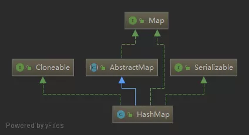

# java.lang.util.HashMap

## 一、简介

HashMap 采用 key/value 存储结构，每个 key 对应唯一的 value，查询和修改的速度都很快，能达到O(1)的平均时间复杂度。**它是非线程安全的，且不保证元素存储的顺序**。

## 二、继承体系



HashMap实现了Cloneable，可以被克隆。

HashMap实现了Serializable，可以被序列化。

HashMap继承自AbstractMap，实现了Map接口，具有Map的所有功能。

## 三、存储结构


**在 Java 中，HashMap 的实现采用了（数组 + 链表 + 红黑树）的复杂结构，数组的一个元素又称作桶**。数组是HashMap的主体，链表则是主要为了解决哈希冲突而存在的，

在添加元素时，会根据 hash 值算出元素在数组中的位置，如果该位置没有元素，则直接把元素放置在此处，如果该位置有元素了，则把元素以链表的形式放置在链表的尾部。

当一个链表的元素个数达到一定的数量（且数组的长度达到一定的长度）后，则把链表转化为红黑树，从而提高效率。

**数组的查询效率为O(1)，链表的查询效率是O(k)，红黑树的查询效率是O(log k)，k为桶中的元素个数，所以当元素数量非常多的时候，转化为红黑树能极大地提高效率**。

==解决 hash 冲突的方法:==

- 开放地址法(发生冲突，继续寻找下一块未被占用的存储地址)
- 再散列函数法
- 链地址法(HashMap采用的就是这种方法)


## 三、源码解析

### （一）属性

```java
/**
     * 默认的初始容量（容量为 HashMap 中槽的数目）是 16，且实际容量必须是 2 的整数次幂。
     */
static final int DEFAULT_INITIAL_CAPACITY = 1 << 4; // aka 16

/**
     * 最大容量（必须是 2 的幂且小于 2 的 30 次方，传入容量超过这个值的时候就会使用该值代替传入的值）
     */
static final int MAXIMUM_CAPACITY = 1 << 30;

/**
     * 默认装填因子 0.75，如果当前键值对个数 >= HashMap 最大容量 * 装填因子，进行 rehash 操作
     */
static final float DEFAULT_LOAD_FACTOR = 0.75f;

/**
     * JDK1.8 新加，Entry 链表最大长度，当桶中节点数目大于该长度时，将链表转成红黑树存储；
     */
static final int TREEIFY_THRESHOLD = 8;

/**
     * JDK1.8 新加，当桶中节点数小于该长度，将红黑树转为链表存储；
     */
static final int UNTREEIFY_THRESHOLD = 6;

/**
     * 桶可能被转化为树形结构的最小容量。当哈希表的大小超过这个阈值，才会把链式结构转化成树型结构，否则仅采取扩容来尝试减少冲突。即当桶的个数大于 64 之后才会才会进行树化
     * 应该至少4*TREEIFY_THRESHOLD来避免扩容和树形结构化之间的冲突。
     */
static final int MIN_TREEIFY_CAPACITY = 64;


/**
     * 哈希桶数组，分配的时候，table 的长度总是 2 的幂
     */
transient Node<K, V>[] table;

/**
     * HashMap 将数据转换成 set 的另一种存储形式，这个变量主要用于迭代功能
     */
transient Set<Entry<K, V>> entrySet;

/**
     * 实际存储的数量，则 HashMap 的 size() 方法，实际返回的就是这个值，isEmpty() 也是判断该值是否为0
     */
transient int size;

/**
     * hashmap 结构被改变的次数，用于在迭代的时候执行快速失败策略
     */
transient int modCount;

/**
     * HashMap 的扩容阈值，在 HashMap 中存储的 Node 键值对超过这个数量时，自动扩容容量为原来的二倍
     *
     * @serial
     */
int threshold;

/**
     * HashMap 的加载因子，可计算出当前 table 长度下的扩容阈值：threshold = loadFactor * table.length
     *
     * @serial
     */
final float loadFactor;
```

- 容量

    容量为数组的长度，亦即桶的个数，默认为 16，最大为 2 的 30 次方，当容量达到64时才可以树化。

- 装载因子

    装载因子用来计算容量达到多少时才进行扩容，默认装载因子为0.75。

- 树化

    树化，当容量达到 64 且链表的长度达到 8 时进行树化，当链表的长度小于 6 时反树化。


### .负载因子为什么是0.75

通俗地说默认负载因子(0.75)在时间和空间成本上提供了很好的折中;

理想状态下,在随机哈希值的情况，对于loadfactor = 0.75 ,虽然由于粒度调整会产生较大的方差,桶中的Node的分布频率服从参数为0.5的泊松分布;一个bucket空和非空的概率为0.5，通过牛顿二项式等数学计算，得到这个loadfactor的值为log（2），约等于0.693.同回答者所说，可能小于0.75 大于等于log（2）的factor都能提供更好的性能，0.75这个数说不定是 pulled out of a hat

[泊松分布](http://www.ruanyifeng.com/blog/2015/06/poisson-distribution.html#comment-356111)
[Stackoverflow-老外的牛顿二项式](https://stackoverflow.com/questions/10901752/what-is-the-significance-of-load-factor-in-hashmap)


### （二）Node内部类

Node 是一个典型的单链表节点，其中，hash 用来存储 key 计算得来的 hash 值。

```java
/**
     * JDK1.6 用 Entry 描述键值对，JDK1.8 中用 Node 代替 Entry
     */
static class Node<K, V> implements Entry<K, V> {
    // hash 存储 key 的 hashCode
    final int hash;
    // final:一个键值对的 key 不可改变
    final K key;
    V value;
    // 指向下个节点的引用
    Node<K, V> next;
}
```

### （三）TreeNode内部类

这是一个神奇的类，它继承自 LinkedHashMap 中的 Entry 类。

TreeNode 是一个典型的树型节点，其中，prev 是链表中的节点，用于在删除元素的时候可以快速找到它的前置节点。

```java
/**
// 位于HashMap中
     * JDK1.8新增，用来支持桶的红黑树结构实现
     * 性质1. 节点是红色或黑色。
     * 性质2. 根是黑色。
     * 性质3. 所有叶子都是黑色（叶子是 NIL 节点）。
     * 性质4. 每个红色节点必须有两个黑色的子节点。(从每个叶子到根的所有路径上不能有两个连续的红色节点。)
     * 性质5. 从任一节点到其每个叶子的所有简单路径都包含相同数目的黑色节点。
     */

static final class TreeNode<K, V> extends LinkedHashMap.Entry<K, V> {
    TreeNode<K, V> parent;  //节点的父亲
    TreeNode<K, V> left;    //节点的左孩子
    TreeNode<K, V> right;   //节点的右孩子
    TreeNode<K, V> prev;    //节点的前一个节点
    boolean red;            //true 表示红节点，false 表示黑节点

    TreeNode(int hash, K key, V val, Node<K, V> next) {
        super(hash, key, val, next);
    }

    /**
     *  位于LinkedHashMap中，典型的双向链表节点
     */
    static class Entry<K,V> extends HashMap.Node<K,V> {
        Entry<K,V> before, after;
        Entry(int hash, K key, V value, Node<K,V> next) {
            super(hash, key, value, next);
        }
    }
```

### （四）HashMap()构造方法

空参构造方法，全部使用默认值。

```java
/**
     * 使用指定的初始化容量（16）和默认加载因子DEFAULT_LOAD_FACTOR（0.75）构造一个空HashMap
     */
public HashMap() {
    this.loadFactor = DEFAULT_LOAD_FACTOR; // all other fields defaulted
}
```

### （五）HashMap(int initialCapacity)构造方法

调用 HashMap(int initialCapacity, float loadFactor) 构造方法，传入默认装载因子。

```java
/**
     * 使用指定的初始化容量initial capacity和默认加载因子DEFAULT_LOAD_FACTOR（0.75）构造一个空HashMap,但是实际上允许的空间为比 initial capacity 最近且比其大的 2 的 n 次幂
     *
     * @param initialCapacity 初始化容量
     * @throws IllegalArgumentException 如果指定的初始化容量为负数
     */
public HashMap(int initialCapacity) {
    this(initialCapacity, DEFAULT_LOAD_FACTOR);
}
```

### （六）HashMap(int initialCapacity, float loadFactor)构造方法

判断传入的初始容量和装载因子是否合法，并计算扩容门槛，扩容门槛为传入的初始容量往上取最近的 2 的 n 次方。

```java
/**
     * 使用指定的初始化容量initial capacity 和加载因子load factor构造一个空HashMap
     *
     * @param initialCapacity 初始化容量
     * @param loadFactor      加载因子
     * @throws IllegalArgumentException 如果指定的初始化容量为负数或者加载因子为非正数
     */
public HashMap(int initialCapacity, float loadFactor) {
    // 检查传入的初始容量是否合法	
    if (initialCapacity < 0)
        throw new IllegalArgumentException("Illegal initial capacity: " +
                                           initialCapacity);
    if (initialCapacity > MAXIMUM_CAPACITY)
        initialCapacity = MAXIMUM_CAPACITY;
    // 检查装载因子是否合法
    if (loadFactor <= 0 || Float.isNaN(loadFactor))
        throw new IllegalArgumentException("Illegal load factor: " +
                                           loadFactor);
    this.loadFactor = loadFactor;
    // 计算扩容门槛
    this.threshold = tableSizeFor(initialCapacity);
}

/**
     * 结果为 >=cap 的最小 2 的自然数幂，扩容门槛为传入的初始容量往上取最近的2的n次方
     */
    static final int tableSizeFor(int cap) {
        // 先移位再或运算，最终保证返回值是 2 的整数幂
        int n = cap - 1;
        n |= n >>> 1;
        n |= n >>> 2;
        n |= n >>> 4;
        n |= n >>> 8;
        n |= n >>> 16;
        return (n < 0) ? 1 : (n >= MAXIMUM_CAPACITY) ? MAXIMUM_CAPACITY : n + 1;
    }
/**    为什么上述的位运算能得到大于参数且最近的2的整数次幂的数呢?
    答:| 为或操作符, >>>y为无符号右移y位 ,空位补0,
       n |= n >>> y会导致它的高n+1位全为1,
       最终n将为111111..1 加1,即为100000..00,即2的整次幂;
   */
```

### （七）==put(K key, V value)方法==

添加元素的入口。

```java
/**
     * 将指定参数key和指定参数value插入map中，如果key已经存在，那就替换key对应的value
     * put(K key, V value)可以分为三个步骤：
     * 1.通过hash(Object key)方法计算key的哈希值。
     * 2.通过putVal(hash(key), key, value, false, true)方法实现功能。
     * 3.返回putVal方法返回的结果。
     *
     * @param key   指定key
     * @param value 指定value
     * @return 如果value被替换，则返回旧的value，否则返回null。当然，可能key对应的value就是null
     */
public V put(K key, V value) {
    // 倒数第二个参数 false：表示允许旧值替换，最后一个参数 true：表示 HashMap 不处于创建模式
    // 调用 hash(key) 计算出 key 的 hash 值
    return putVal(hash(key), key, value, false, true);
}


/**
     * HashMap中键值对的存储形式为链表节点，hashCode相同的节点（位于同一个桶）用链表组织
     * hash方法分为三步:
     * 1.取key的hashCode
     * 2.key的hashCode高16位异或低16位
     * 3.将第一步和第二步得到的结果进行取模运算。
     */
static final int hash(Object key) {
    int h;
    // 如果 key 为 null，则 hash 值为 0，否则调用 key 的 hashCode() 方法
    // h >>> 16 表示对 h 无符号右移 16 位，高位补 0，然后 h 与 h >>> 16 按位异或，这样做可以使得计算出来的 hash 更加分散
    return (key == null) ? 0 : (h = key.hashCode()) ^ (h >>> 16);
}

/**
     * Map.put和其他相关方法的实现需要的方法
     * putVal方法可以分为下面的几个步骤:
     * 1.如果哈希表为空，调用resize()创建一个哈希表。
     * 2.如果指定参数hash在表中没有对应的桶，即为没有碰撞，直接将键值对插入到哈希表中即可。
     * 3.如果有碰撞，遍历桶，找到key映射的节点
     * 3.1桶中的第一个节点就匹配了，将桶中的第一个节点记录起来。
     * 3.2如果桶中的第一个节点没有匹配，且桶中结构为红黑树，则调用红黑树对应的方法插入键值对。
     * 3.3如果不是红黑树，那么就肯定是链表。遍历链表，如果找到了key映射的节点，就记录这个节点，退出循环。如果没有找到，在链表尾部插入节点。插入后，如果链的长度大于TREEIFY_THRESHOLD这个临界值，则使用treeifyBin方法把链表转为红黑树。
     * 4.如果找到了key映射的节点，且节点不为null
     * 4.1记录节点的vlaue。
     * 4.2如果参数onlyIfAbsent为false，或者oldValue为null，替换value，否则不替换。
     * 4.3返回记录下来的节点的value。
     * 5.如果没有找到key映射的节点（2、3步中讲了，这种情况会插入到hashMap中），插入节点后size会加1，这时要检查size是否大于临界值threshold，如果大于会使用resize方法进行扩容。
     *
     * @param hash         指定参数key的哈希值
     * @param key          指定参数key
     * @param value        指定参数value
     * @param onlyIfAbsent 如果为true，即使指定参数key在map中已经存在，也不会替换value
     * @param evict        如果为false，数组table在创建模式中
     * @return 如果value被替换，则返回旧的value，否则返回null。当然，可能key对应的value就是null。
     */
final V putVal(int hash, K key, V value, boolean onlyIfAbsent,
               boolean evict) {
    Node<K, V>[] tab;
    Node<K, V> p;
    int n, i;
    // 如果哈希表为空（桶的数量为 0 ），调用 resize() 创建一个哈希表，并用变量 n 记录哈希表长度
    if ((tab = table) == null || (n = tab.length) == 0)
        n = (tab = resize()).length;
    /**
      * (n - 1) & hash 计算元素在哪个桶中，其中 (n - 1) & hash 本质上是hash % n，位运算更快
	  * 如果这个桶中还没有元素，则把这个元素放在桶中的第一个位置
      * 	
      */
    if ((p = tab[i = (n - 1) & hash]) == null)
        // 直接新建一个节点放入到 map 中即可
        tab[i] = newNode(hash, key, value, null);
    else {
        // 如果该桶中已经存在元素
        Node<K, V> e;
        K k;
        // 比较桶中第一个元素(数组中的结点)的 hash 值相等，key 相等，即如果桶中第一个元素的 key 与待插入元素的 key 相同，保存到 e 中用于后续修改 value 值
        if (p.hash == hash &&
            ((k = p.key) == key || (key != null && key.equals(k))))
            // 将第一个元素赋值给 e，用 e 来记录
            e = p;
        // 当前桶中无该键值对，且桶是红黑树结构，按照红黑树结构插入，即如果第一个元素是树节点，则调用树节点的 putTreeVal 插入元素
        else if (p instanceof TreeNode)
            e = ((TreeNode<K, V>) p).putTreeVal(this, tab, hash, key, value);
        // 当前桶中无该键值对，且桶是链表结构，遍历这个桶对应的链表，按照链表结构插入到尾部，binCount 用于存储链表中元素的个数
        else {
            for (int binCount = 0; ; ++binCount) {
                // 如果链表遍历完了都没有找到相同 key 的元素，说明该 key 对应的元素不存在，则在链表最后插入一个新节点
                if ((e = p.next) == null) {
                    p.next = newNode(hash, key, value, null);
                    // 检查链表长度是否达到阈值，达到将该槽位节点组织形式转为红黑树,即如果插入新节点后链表长度大于8，则判断是否需要树化，因为第一个元素没有加到 binCount 中，所以这里-1
                    if (binCount >= TREEIFY_THRESHOLD - 1) // -1 for 1st
                        treeifyBin(tab, hash);
                    break;
                }
                // 如果待插入的 key 在链表中找到了，则退出循环
                if (e.hash == hash &&
                    ((k = e.key) == key || (key != null && key.equals(k))))
                    break;
                p = e;
            }
        }
        // 找到或新建一个 key 和 hashCode 与插入元素相等的键值对，进行 put 操作，如果找到了对应 key 的元素
        if (e != null) { // existing mapping for key
            // 记录 e 的 value
            V oldValue = e.value;
            // 判断是否需要替换旧值：onlyIfAbsent为false或旧值为null时，允许替换旧值否则无需替换
            if (!onlyIfAbsent || oldValue == null)
                e.value = value;
            // 访问后回调，在节点被访问后做点什么事，在LinkedHashMap中用到
            afterNodeAccess(e);
            // 返回旧值
            return oldValue;
        }
    }
    // 更新结构化修改信息，到这里了说明没有找到元素，修改次数加 1
    ++modCount;
    // 元素数量加1，判断是否需要扩容，键值对数目超过阈值时，进行rehash
    if (++size > threshold)
        resize();
    // 插入后回调
    afterNodeInsertion(evict);
    // 没有找到元素返回 null
    return null;
}
```

- 计算 key 的 hash 值；

- 如果桶（数组）数量为0，则初始化桶；

- 如果 key 所在的桶没有元素，则直接插入；

- 如果 key 所在的桶中的第一个元素的 key 与待插入的 key 相同，说明找到了元素，转后续流程 4.2 处理（如果参数 onlyIfAbsent 为 false，或者 oldValue 为 null，替换 value，否则不替换）；

- 如果第一个元素是树节点，则调用树节点的 putTreeVal( ) 寻找元素或插入树节点；

- 如果不是以上三种情况，则遍历桶对应的链表查找 key 是否存在于链表中；

- 如果找到了对应 key 的元素，则转后续流程（这里的 9 ，代码中的 4.2）处理；

- 如果没找到对应key的元素，则在链表最后插入一个新节点并判断是否需要树化；

- 如果找到了对应key的元素，则判断是否需要替换旧值，并直接返回旧值；

- 如果插入了元素，则数量加1并判断是否需要扩容；

### （八）resize()方法

扩容方法。

```java
   /**
     * 对 table 进行初始化或者扩容。
     * 如果 table 为 null，则对 table 进行初始化
     * 如果对 table 扩容，因为每次扩容都是翻倍，与原来计算（n-1）& hash 的结果相比，节点要么就在原来的位置，要么就被分配到“原位置+旧容量”这个位置
     * resize的步骤总结为:
     * 1.计算扩容后的容量，临界值。
     * 2.将hashMap的临界值修改为扩容后的临界值
     * 3.根据扩容后的容量新建数组，然后将hashMap的table的引用指向新数组。
     * 4.将旧数组的元素复制到table中。
     *
     * @return the table
     */
final Node<K, V>[] resize() {
    // 旧数组
    Node<K, V>[] oldTab = table;
    // 旧容量
    int oldCap = (oldTab == null) ? 0 : oldTab.length;
    // 旧扩容门槛
    int oldThr = threshold;
    int newCap, newThr = 0;
    if (oldCap > 0) {
        if (oldCap >= MAXIMUM_CAPACITY) {
            // 如果旧容量达到了最大容量，则不再进行扩容
            threshold = Integer.MAX_VALUE;
            return oldTab;
        } else if ((newCap = oldCap << 1) < MAXIMUM_CAPACITY &&
                oldCap >= DEFAULT_INITIAL_CAPACITY)
            // 如果旧容量的两倍小于最大容量并且旧容量大于默认初始容量（16），则容量扩大为两部，扩容门槛也扩大为两倍
            newThr = oldThr << 1;
    } else if (oldThr > 0) 
        // 使用非默认构造方法创建的 map，第一次插入元素会走到这里
        // 如果旧容量为 0 且旧扩容门槛大于 0，则把新容量赋值为旧门槛
        newCap = oldThr;
    else {              
        // 调用默认构造方法创建的 map，第一次插入元素会走到这里
        // 如果旧容量旧扩容门槛都是 0，说明还未初始化过，则初始化容量为默认容量，扩容门槛为默认容量*默认装载因子
        newCap = DEFAULT_INITIAL_CAPACITY;
        newThr = (int) (DEFAULT_LOAD_FACTOR * DEFAULT_INITIAL_CAPACITY);
    }
    if (newThr == 0) {
        // 如果新扩容门槛为 0，则计算为容量*装载因子，但不能超过最大容量
        float ft = (float) newCap * loadFactor;
        newThr = (newCap < MAXIMUM_CAPACITY && ft < (float) MAXIMUM_CAPACITY ?
                (int) ft : Integer.MAX_VALUE);
    }
    // 赋值扩容门槛为新门槛
    threshold = newThr;
    // 新建一个新容量的数组
    @SuppressWarnings({"rawtypes", "unchecked"})
    Node<K, V>[] newTab = (Node<K, V>[]) new Node[newCap];
    // 把桶赋值为新数组
    table = newTab;
    // 如果旧数组不为空，则搬移元素
    if (oldTab != null) {
        // 遍历旧数组
        for (int j = 0; j < oldCap; ++j) {
            Node<K, V> e;
            // 如果桶中第一个元素不为空，赋值给e
            if ((e = oldTab[j]) != null) {
                // 清空旧桶，便于GC回收  
                oldTab[j] = null;
                // 如果这个桶中只有一个元素，则计算它在新桶中的位置并把它搬移到新桶中
                // 因为每次都扩容两倍，所以这里的第一个元素搬移到新桶的时候新桶肯定还没有元素
                if (e.next == null)
                    newTab[e.hash & (newCap - 1)] = e;
                else if (e instanceof TreeNode)
                    // 如果第一个元素是树节点，则把这颗树打散成两颗树插入到新桶中去
                    ((TreeNode<K, V>) e).split(this, newTab, j, oldCap);
                else { // preserve order
                    // 如果这个链表不止一个元素且不是一颗树
                    // 则分化成两个链表插入到新的桶中去
                    // 比如，假如原来容量为4，3、7、11、15这四个元素都在三号桶中
                    // 现在扩容到8，则3和11还是在三号桶，7和15要搬移到七号桶中去
                    // 也就是分化成了两个链表
                    Node<K, V> loHead = null, loTail = null;
                    Node<K, V> hiHead = null, hiTail = null;
                    Node<K, V> next;
                    do {
                        next = e.next;
                        // (e.hash & oldCap) == 0的元素放在低位链表中
                        // 比如，3 & 4 == 0
                        if ((e.hash & oldCap) == 0) {
                            if (loTail == null)
                                loHead = e;
                            else
                                loTail.next = e;
                            loTail = e;
                        } else {
                            // (e.hash & oldCap) != 0的元素放在高位链表中
                            // 比如，7 & 4 != 0
                            if (hiTail == null)
                                hiHead = e;
                            else
                                hiTail.next = e;
                            hiTail = e;
                        }
                    } while ((e = next) != null);
                    // 遍历完成分化成两个链表了
                    // 低位链表在新桶中的位置与旧桶一样（即3和11还在三号桶中）
                    if (loTail != null) {
                        loTail.next = null;
                        newTab[j] = loHead;
                    }
                    // 高位链表在新桶中的位置正好是原来的位置加上旧容量（即7和15搬移到七号桶了）
                    if (hiTail != null) {
                        hiTail.next = null;
                        newTab[j + oldCap] = hiHead;
                    }
                }
            }
        }
    }
    return newTab;
}
```


- 如果使用是默认构造方法，则第一次插入元素时初始化为默认值，容量为16，扩容门槛为12；

- 如果使用的是非默认构造方法，则第一次插入元素时初始化容量等于扩容门槛，扩容门槛在构造方法里等于传入容量向上最近的 2 的 n 次方；

- 如果旧容量大于 0，则新容量等于旧容量的 2 倍，但不超过最大容量 2 的 30 次方，新扩容门槛为旧扩容门槛的 2 倍；

- 创建一个新容量的桶；

- 搬移元素，原链表分化成两个链表，低位链表存储在原来桶的位置，高位链表搬移到原来桶的位置加旧容量的位置；

### （九）TreeNode.putTreeVal(...)方法

插入元素到红黑树中的方法。

```java
final TreeNode<K, V> putTreeVal(HashMap<K, V> map, Node<K, V>[] tab,
                                int h, K k, V v) {
    Class<?> kc = null;
    // 标记是否找到这个 key 的节点
    boolean searched = false;
    // 找到树的根节点
    TreeNode<K, V> root = (parent != null) ? root() : this;
    // 从树的根节点开始遍历
    for (TreeNode<K, V> p = root; ; ) {
        // dir = direction，标记是在左边还是右边
        // ph = p.hash，当前节点的 hash 值
        int dir, ph;
        // pk = p.key，当前节点的 key 值
        K pk;
        if ((ph = p.hash) > h) {
            // 当前 hash 比目标 hash 大，说明在左边
            dir = -1;
        }
        else if (ph < h)
            // 当前 hash 比目标 hash 小，说明在右边
            dir = 1;
        else if ((pk = p.key) == k || (k != null && k.equals(pk)))
            // 两者 hash 相同且 key 相等，说明找到了节点，直接返回该节点
            // 回到 putVal() 中判断是否需要修改其 value 值
            return p;
        else if ((kc == null &&
                // 如果 k 是 Comparable 的子类则返回其真实的类，否则返回 null
                (kc = comparableClassFor(k)) == null) ||
                // 如果 k 和 pk 不是同样的类型则返回0，否则返回两者比较的结果
                (dir = compareComparables(kc, k, pk)) == 0) {
            // 这个条件表示两者 hash 相同但是其中一个不是 Comparable 类型或者两者类型不同
            // 比如 key 是 Object 类型，这时可以传 String 也可以传 Integer，两者 hash 值可能相同，在红黑树中把同样 hash 值的元素存储在同一颗子树，这里相当于找到了这颗子树的顶点，从这个顶点分别遍历其左右子树去寻找有没有跟待插入的 key 相同的元素
            if (!searched) {
                TreeNode<K, V> q, ch;
                searched = true;
                // 遍历左右子树找到了直接返回
                if (((ch = p.left) != null &&
                        (q = ch.find(h, k, kc)) != null) ||
                        ((ch = p.right) != null &&
                                (q = ch.find(h, k, kc)) != null))
                    return q;
            }
            // 如果两者类型相同，再根据它们的内存地址计算 hash 值进行比较
            dir = tieBreakOrder(k, pk);
        }

        TreeNode<K, V> xp = p;
        if ((p = (dir <= 0) ? p.left : p.right) == null) {
            // 如果最后确实没找到对应key的元素，则新建一个节点
            Node<K, V> xpn = xp.next;
            TreeNode<K, V> x = map.newTreeNode(h, k, v, xpn);
            if (dir <= 0)
                xp.left = x;
            else
                xp.right = x;
            xp.next = x;
            x.parent = x.prev = xp;
            if (xpn != null)
                ((TreeNode<K, V>) xpn).prev = x;
            // 插入树节点后平衡
            // 把root节点移动到链表的第一个节点
            moveRootToFront(tab, balanceInsertion(root, x));
            return null;
        }
    }
}
```

- 寻找根节点；

- 从根节点开始查找；

- 比较 hash 值及 key 值，如果都相同，直接返回，在 putVal() 方法中决定是否要替换 value 值；

- 根据 hash 值及 key 值确定在树的左子树还是右子树查找，找到了直接返回；

- 如果最后没有找到则在树的相应位置插入元素，并做平衡；

### （十）treeifyBin()方法

如果插入元素后链表的长度大于等于 8 则判断是否需要树化。

```java
final void treeifyBin(Node<K, V>[] tab, int hash) {
    int n, index;
    Node<K, V> e;
    if (tab == null || (n = tab.length) < MIN_TREEIFY_CAPACITY)
        // 如果桶数量小于 64，直接扩容而不用树化，因为扩容后，链表会分化成两个链表，达到减少元素的作用
        // 当然也不一定，比如容量为 4，里面存的全是除以 4 余数等于 3 的元素，这样即使扩容也无法减少链表的长度
        resize();
    else if ((e = tab[index = (n - 1) & hash]) != null) {
        TreeNode<K, V> hd = null, tl = null;
        // 把所有节点换成树节点
        do {
            TreeNode<K, V> p = replacementTreeNode(e, null);
            if (tl == null)
                hd = p;
            else {
                p.prev = tl;
                tl.next = p;
            }
            tl = p;
        } while ((e = e.next) != null);
        // 如果进入过上面的循环，则从头节点开始树化
        if ((tab[index] = hd) != null)
            hd.treeify(tab);
    }
}
```

### （十一）TreeNode.treeify()方法

真正树化的方法。

```java
final void treeify(Node<K, V>[] tab) {
    TreeNode<K, V> root = null;
    for (TreeNode<K, V> x = this, next; x != null; x = next) {
        next = (TreeNode<K, V>) x.next;
        x.left = x.right = null;
        // 第一个元素作为根节点且为黑节点，其它元素依次插入到树中再做平衡
        if (root == null) {
            x.parent = null;
            x.red = false;
            root = x;
        } else {
            K k = x.key;
            int h = x.hash;
            Class<?> kc = null;
            // 从根节点查找元素插入的位置
            for (TreeNode<K, V> p = root; ; ) {
                int dir, ph;
                K pk = p.key;
                if ((ph = p.hash) > h)
                    dir = -1;
                else if (ph < h)
                    dir = 1;
                else if ((kc == null &&
                        (kc = comparableClassFor(k)) == null) ||
                        (dir = compareComparables(kc, k, pk)) == 0)
                    dir = tieBreakOrder(k, pk);

                // 如果最后没找到元素，则插入
                TreeNode<K, V> xp = p;
                if ((p = (dir <= 0) ? p.left : p.right) == null) {
                    x.parent = xp;
                    if (dir <= 0)
                        xp.left = x;
                    else
                        xp.right = x;
                    // 插入后平衡，默认插入的是红节点，在balanceInsertion()方法里
                    root = balanceInsertion(root, x);
                    break;
                }
            }
        }
    }
    // 把根节点移动到链表的头节点，因为经过平衡之后原来的第一个元素不一定是根节点了
    moveRootToFront(tab, root);
}

```

（1）从链表的第一个元素开始遍历；

（2）将第一个元素作为根节点；

（3）其它元素依次插入到红黑树中，再做平衡；

（4）将根节点移到链表第一元素的位置（因为平衡的时候根节点会改变）；

### （十二）get(Object key)方法

```java
public V get(Object key) {
    Node<K, V> e;
    return (e = getNode(hash(key), key)) == null ? null : e.value;
}

final Node<K, V> getNode(int hash, Object key) {
    Node<K, V>[] tab;
    Node<K, V> first, e;
    int n;
    K k;
    // 如果桶的数量大于 0 并且待查找的 key 所在的桶的第一个元素不为空
    if ((tab = table) != null && (n = tab.length) > 0 &&
            (first = tab[(n - 1) & hash]) != null) {
        // 检查第一个元素是不是要查的元素，如果是直接返回
        if (first.hash == hash && 
                ((k = first.key) == key || (key != null && key.equals(k))))
            return first;
        if ((e = first.next) != null) {
            // 如果第一个元素是树节点，则按树的方式查找
            if (first instanceof TreeNode)
                return ((TreeNode<K, V>) first).getTreeNode(hash, key);

            // 否则就遍历整个链表查找该元素
            do {
                if (e.hash == hash &&
                        ((k = e.key) == key || (key != null && key.equals(k))))
                    return e;
            } while ((e = e.next) != null);
        }
    }
    return null;
}
```

（1）计算key的hash值；

（2）找到key所在的桶及其第一个元素；

（3）如果第一个元素的key等于待查找的key，直接返回；

（4）如果第一个元素是树节点就按树的方式来查找，否则按链表方式查找；

### （十三）TreeNode.getTreeNode(int h, Object k)方法

```java
final TreeNode<K, V> getTreeNode(int h, Object k) {
    // 从树的根节点开始查找
    return ((parent != null) ? root() : this).find(h, k, null);
}

final TreeNode<K, V> find(int h, Object k, Class<?> kc) {
    TreeNode<K, V> p = this;
    do {
        int ph, dir;
        K pk;
        TreeNode<K, V> pl = p.left, pr = p.right, q;
        if ((ph = p.hash) > h)
            // 左子树
            p = pl;
        else if (ph < h)
            // 右子树
            p = pr;
        else if ((pk = p.key) == k || (k != null && k.equals(pk)))
            // 找到了直接返回
            return p;
        else if (pl == null)
            // hash 相同但 key 不同，左子树为空查右子树
            p = pr;
        else if (pr == null)
            // 右子树为空查左子树
            p = pl;
        else if ((kc != null ||
                (kc = comparableClassFor(k)) != null) &&
                (dir = compareComparables(kc, k, pk)) != 0)
            // 通过 compare 方法比较 key 值的大小决定使用左子树还是右子树
            p = (dir < 0) ? pl : pr;
        else if ((q = pr.find(h, k, kc)) != null)
            // 如果以上条件都不通过，则尝试在右子树查找
            return q;
        else
            // 都没找到就在左子树查找
            p = pl;
    } while (p != null);
    return null;
}
```

经典二叉查找树的查找过程，先根据hash值比较，再根据key值比较决定是查左子树还是右子树。

### （十四）remove(Object key)方法

```java
public V remove(Object key) {
    Node<K, V> e;
    return (e = removeNode(hash(key), key, null, false, true)) == null ?
            null : e.value;
}

final Node<K, V> removeNode(int hash, Object key, Object value,
                            boolean matchValue, boolean movable) {
    Node<K, V>[] tab;
    Node<K, V> p;
    int n, index;
    // 如果桶的数量大于 0 且待删除的元素所在的桶的第一个元素不为空
    if ((tab = table) != null && (n = tab.length) > 0 &&
            (p = tab[index = (n - 1) & hash]) != null) {
        Node<K, V> node = null, e;
        K k;
        V v;
        if (p.hash == hash &&
                ((k = p.key) == key || (key != null && key.equals(k))))
            // 如果第一个元素正好就是要找的元素，赋值给 node 变量后续删除使用
            node = p;
        else if ((e = p.next) != null) {
            if (p instanceof TreeNode)
                // 如果第一个元素是树节点，则以树的方式查找节点
                node = ((TreeNode<K, V>) p).getTreeNode(hash, key);
            else {
                // 否则遍历整个链表查找元素
                do {
                    if (e.hash == hash &&
                            ((k = e.key) == key ||
                                    (key != null && key.equals(k)))) {
                        node = e;
                        break;
                    }
                    p = e;
                } while ((e = e.next) != null);
            }
        }
        // 如果找到了元素，则看参数是否需要匹配 value 值，如果不需要匹配直接删除，如果需要匹配则看value 值是否与传入的 value 相等
        if (node != null && (!matchValue || (v = node.value) == value ||
                (value != null && value.equals(v)))) {
            if (node instanceof TreeNode)
                // 如果是树节点，调用树的删除方法（以 node 调用的，是删除自己）
                ((TreeNode<K, V>) node).removeTreeNode(this, tab, movable);
            else if (node == p)
                // 如果待删除的元素是第一个元素，则把第二个元素移到第一的位置
                tab[index] = node.next;
            else
                // 否则删除 node 节点
                p.next = node.next;
            ++modCount;
            --size;
            // 删除节点后置处理
            afterNodeRemoval(node);
            return node;
        }
    }
    return null;
}

```

（1）先查找元素所在的节点；

（2）如果找到的节点是树节点，则按树的移除节点处理；

（3）如果找到的节点是桶中的第一个节点，则把第二个节点移到第一的位置；

（4）否则按链表删除节点处理；

（5）修改size，调用移除节点后置处理等；

### （十五）TreeNode.removeTreeNode(...)方法

```java
final void removeTreeNode(HashMap<K, V> map, Node<K, V>[] tab,
                          boolean movable) {
    int n;
    // 如果桶的数量为 0 直接返回
    if (tab == null || (n = tab.length) == 0)
        return;
    // 节点在桶中的索引
    int index = (n - 1) & hash;
    // 第一个节点，根节点，根左子节点
    TreeNode<K, V> first = (TreeNode<K, V>) tab[index], root = first, rl;
    // 后继节点，前置节点
    TreeNode<K, V> succ = (TreeNode<K, V>) next, pred = prev;

    if (pred == null)
        // 如果前置节点为空，说明当前节点是根节点，则把后继节点赋值到第一个节点的位置，相当于删除了当前节点
        tab[index] = first = succ;
    else
        // 否则把前置节点的下个节点设置为当前节点的后继节点，相当于删除了当前节点
        pred.next = succ;

    // 如果后继节点不为空，则让后继节点的前置节点指向当前节点的前置节点，相当于删除了当前节点
    if (succ != null)
        succ.prev = pred;

    // 如果第一个节点为空，说明没有后继节点了，直接返回
    if (first == null)
        return;

    // 如果根节点的父节点不为空，则重新查找父节点
    if (root.parent != null)
        root = root.root();

    // 如果根节点为空，则需要反树化（将树转化为链表）
    // 如果需要移动节点且树的高度比较小，则需要反树化
    if (root == null
            || (movable
            && (root.right == null
            || (rl = root.left) == null
            || rl.left == null))) {
        tab[index] = first.untreeify(map);  // too small
        return;
    }

    // 分割线，以上都是删除链表中的节点，下面才是直接删除红黑树的节点（因为TreeNode本身即是链表节点又是树节点）

    // 删除红黑树节点的大致过程是寻找右子树中最小的节点放到删除节点的位置，然后做平衡，此处不过多注释
    TreeNode<K, V> p = this, pl = left, pr = right, replacement;
    if (pl != null && pr != null) {
        TreeNode<K, V> s = pr, sl;
        while ((sl = s.left) != null) // find successor
            s = sl;
        boolean c = s.red;
        s.red = p.red;
        p.red = c; // swap colors
        TreeNode<K, V> sr = s.right;
        TreeNode<K, V> pp = p.parent;
        if (s == pr) { // p was s's direct parent
            p.parent = s;
            s.right = p;
        } else {
            TreeNode<K, V> sp = s.parent;
            if ((p.parent = sp) != null) {
                if (s == sp.left)
                    sp.left = p;
                else
                    sp.right = p;
            }
            if ((s.right = pr) != null)
                pr.parent = s;
        }
        p.left = null;
        if ((p.right = sr) != null)
            sr.parent = p;
        if ((s.left = pl) != null)
            pl.parent = s;
        if ((s.parent = pp) == null)
            root = s;
        else if (p == pp.left)
            pp.left = s;
        else
            pp.right = s;
        if (sr != null)
            replacement = sr;
        else
            replacement = p;
    } else if (pl != null)
        replacement = pl;
    else if (pr != null)
        replacement = pr;
    else
        replacement = p;
    if (replacement != p) {
        TreeNode<K, V> pp = replacement.parent = p.parent;
        if (pp == null)
            root = replacement;
        else if (p == pp.left)
            pp.left = replacement;
        else
            pp.right = replacement;
        p.left = p.right = p.parent = null;
    }

    TreeNode<K, V> r = p.red ? root : balanceDeletion(root, replacement);

    if (replacement == p) {  // detach
        TreeNode<K, V> pp = p.parent;
        p.parent = null;
        if (pp != null) {
            if (p == pp.left)
                pp.left = null;
            else if (p == pp.right)
                pp.right = null;
        }
    }
    if (movable)
        moveRootToFront(tab, r);
}
```

（1）TreeNode本身既是链表节点也是红黑树节点；

（2）先删除链表节点；

（3）再删除红黑树节点并做平衡；

## 总结

（1）HashMap 是一种散列表，采用（数组 + 链表 + 红黑树）的存储结构；

（2）HashMap 的默认初始容量为 16（1<<4），默认装载因子为 0 .75f，容量总是 2 的 n 次方；

（3）HashMap 扩容时每次容量变为原来的两倍；

（4）当桶的数量小 于64 时不会进行树化，只会扩容；

（5）当桶的数量大于 64 且单个桶中元素的数量大于 8 时，进行树化；

（6）当单个桶中元素数量小于 6 时，进行反树化；

（7）HashMap 是非线程安全的容器；

（8）HashMap 查找添加元素的时间复杂度都为 O(1)；

## 彩蛋

红黑树知多少？

红黑树具有以下5种性质：

（1）节点是红色或黑色。

（2）根节点是黑色。

（3）每个叶节点（NIL节点，空节点）是黑色的。

（4）每个红色节点的两个子节点都是黑色。(从每个叶子到根的所有路径上不能有两个连续的红色节点)

（5）从任一节点到其每个叶子的所有路径都包含相同数目的黑色节点。

红黑树的时间复杂度为O(log n)，与树的高度成正比。

红黑树每次的插入、删除操作都需要做平衡，平衡时有可能会改变根节点的位置，颜色转换，左旋，右旋等。


#### 1.1.2.3 基本操作

##### 1.1.2.3.1 如何获取Hash值

 - 扰动函数

  **[1]获取hashCode值** 

```java
   public final int hashCode() {
            return Objects.hashCode(key) ^ Objects.hashCode(value);
        }
```

  **[2]获取key的hash值** 

```java
  static final int hash(Object key) {
        int h;
        return (key == null) ? 0 : (h = key.hashCode()) ^ (h >>> 16);
  }
```

  <font color="red"> **扰动函数解析:** </font>

```
  上述代码中key.hashCode()函数调用的是超类Object类中的哈希函数,JVM进而调用本地方法,返回一个int值;
  理论上是一个int类型的值,范围为-2147483648-2147483647,
  前后加起来大概有40亿的映射空间,的确这么大的空间,映射会很均匀
  但是这么大的数组,内存中是放不下的。HashMap的初始化数组只有16
  ,所以这个散列值是无法直接拿来用的,所以要对hashCode做一些处理
  ,具体在下面小节中解答;
  
  扰动函数的结果: key的hash是hashCode中高位和低位的复合产物;
```

##### 1.1.2.3.2 获取桶索引位置

```
  JDK 1.8中是直接通过p = tab[i = (n - 1) & hash这个方法来确定桶索引位置的;
  
  [1]hash为扰动函数的产物;
  [2]n-1为当前hashmap的数组个数len-1;
  
  此时,我们会有诸多疑问,比如:
  【1】为什么要做&运算呢?
    
   答: 与操作的结果就是高位全部归零,只保留低位值,用来做数组下标访问。
   举一个例子说明,初始化长度为16,16-1=15 . 
   2进制(4字节,32位)表示就是 00000000 00000000 00000000 00001111 
   和 某散列值做与操作结果就是
   00000000 10100101 11000100 00100101
   00000000 00000000 00000000 00001111
 & -------------------------------------
   00000000 00000000 00000000 00000101 //高位全部归零,只保留尾部四位
   
  【2】为什么是 n-1 呢? 
   答: 源头就是HashMap的数组长度为什么要取2的整数幂?
   因为这样(n-1)
   相当于一个"低位掩码"; 
   这样能结合下面的&运算使散列更为均匀,减少冲突
   (相对其他数字来说,比如10的话,下面我们以00100101和00110001这两个数做一个例子说明)
    
    和15&      和10&       和15&    和10&
   00100101  00100101    00110001  00110001
   00001111  00001010    00001111  00001010
   &-------  --------    --------  --------
   00000101  00000000    00000001  00000000
   
   我们发现两个不同的数00100101 和0011001 分别和15以及10做与运算,
   和15做&运算会得到两个不同的结果(即会被散列到不同的桶位置上),而和10做与运算得到的是相同的结果(散列到同一个位置上),
   这就会出现冲突!!!!!
   
  【3】hash&(len-1) 和 hash%len 的效果是相同的;
   
   例如 x=1<<4,即2^4=16;
   x:   00010000
   x-1: 00001111
   我们假设一个数M=01011011 (十进制为:Integer.valueOf("01011011",2) = 91)
   M :  01011011
   x-1: 00001111
   &-------------
        00001011(十进制数为:11)
   
   91 % 16 = 11
   证明两者效果相同,位运算的性能更高在操作系统级别来分析;
  【4】为什么扰动函数是那样子的呢?
   如下图所示,h>>>16 之后和h 做异或运算得到的hash前半部分是h的高8位,
   后半部分是hash的高16位和低16位的复合产物;
```


2.1 扩容机制

resize() 方法用于初始化数组(初始化数组过程由于涉及到类加载过程,将会放到JVM模块中进一步解释)或数组扩容，每次扩容后，容量为原来的 2 倍,并进行数据迁移。

#### 2.1.1 扩容后位置变化

每次扩容，新容量为旧容量的2倍;
扩容之后元素的位置
[1]要么在原来位置上
[2]要么在原位置再移动2^n的位置上;

 - **解释过程**

 ```
hashmap的原来桶数量为16,即n-1=15(二进制表示:1111)
[1]扩容前
n-1 :  0000 0000 0000 0000 0000 0000 0000 1111
hash1: 1111 1111 1111 1111 0000 1111 0000 0101
     &----------------------------------------
       0000 0000 0000 0000 0000 0000 0000 0101 (桶位置为5)
       
       
n-1 :  0000 0000 0000 0000 0000 0000 0000 1111       
hash2: 1111 1111 1111 1111 0000 1111 0001 0101
     &----------------------------------------
       0000 0000 0000 0000 0000 0000 0000 0101 (桶位置也是5)
两个hash值不同的对象,和n-1做&运算之后,得到相同的结果;
[2]扩容后
hashmap此时桶的数量变为32,即n-1=31(二进制表示:11111)
n-1:   0000 0000 0000 0000 0000 0000 0001 1111
hash1: 1111 1111 1111 1111 0000 1111 0000 0101
      &---------------------------------------
       0000 0000 0000 0000 0000 0000 0000 0101 (扩容后,桶位置依旧是5)
       
n-1:   0000 0000 0000 0000 0000 0000 0001 1111
hash2: 1111 1111 1111 1111 0000 1111 0001 0101
      &---------------------------------------
       0000 0000 0000 0000 0000 0000 0001 0101 (扩容后,桶位置变为之前5+2^4=21)
 ```

```
  元素在hashmap扩容之后,会重新计算桶下标,从上面的例子中可以看出来,hash1的桶位置在扩容前后没有发生变化,hash2的桶位置在扩容前后发生了变化;
```

>上述扩容过程中&运算的关键点就在于扩容之后新的长度(n-1)转化为2进制之后新增的bit为1,而key的hash 值所对应位置的bit是1 还是0,如果是0的话那么桶位置就不会变化,依旧为index;是1 的话桶位置就会变成index+oldCap;通过if((e.hash&oldCap)==0)来判断hash的新增判断bit是1还是0;

#### 2.1.2 HashMap扩容为啥是2倍扩展

综上所述，根本原因为2进制数字;


#### 2.3.1 线程不安全的表现

- JDK 1.7: **并发死环，丢数据**
- JDK 1.8: **并发丢数据**

#### 2.3.2 源码分析

##### 2.3.2.1 新增节点顺序

 - JDK 1.7
    - **<font color='red'>头插法</font>** : 新增节点插入链表头部
 - JDK 1.8
    - **<font color='red'>尾插法</font>** : 新增节点插入链表尾部
- <b>源码分析与参考</b>:
    - [HashMap到底是插入链表头部还是尾部](https://blog.csdn.net/qq_33256688/article/details/79938886)

##### 2.3.2.2 JDK1.7死环源码分析

```
   说到根本就是扩容之后,链表元素顺序发生变化导致的;
   JDK 1.7 中扩容之后 链表顺序会倒置（采用头插法）;
  为什么改为尾插法： 解决死循环是一个点还有一个点就是 当时1.7时候用头插是考虑到了一个所谓的热点数据的点(新插入的数据可能会更早用到)，但这其实是个伪命题,y因为JDK1.7中rehash的时候，旧链表迁移新链表的时候，如果在新表的数组索引位置相同，则链表元素会倒置(就是因为头插) 所以最后的结果 还是打乱了插入的顺序 所以总的来看支撑1.7使用头插的这点原因也不足以支撑下去了 所以就干脆换成尾插 一举多得 个人理解 有问题欢迎指正
```

###### 


###### 2.3.2.2.2 并发请求

##### 2.3.2.3 JDK1.8扩容过程分析

``` 
  JDK 1.8扩容时保持链表顺序不变,避免了死环现象的发生;
```

### 2.4 树状化存储结构

#### 2.4.1 HashMap中引用

（1）如果使用是默认构造方法，则第一次插入元素时初始化为默认值，容量为16，扩容门槛为12；

（1）如果使用是默认构造方法，则第一次插入元素时初始化为默认值，容量为16，扩容门槛为12；