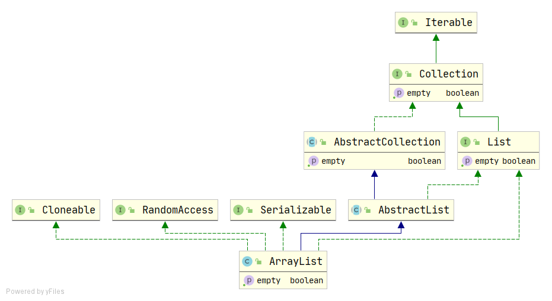

# java.lang.util.ArrayList 简介 

ArrayList 是一种**以数组实现的 List，与数组相比，它具有动态扩展的能力，因此也可称之为动态数组**。

## （一）继承体系



- ArrayList实现了List, RandomAccess, Cloneable, java.io.Serializable等接口。

- ArrayList实现了List，提供了基础的添加、删除、遍历等操作。

- ArrayList实现了RandomAccess，提供了**随机访问的能力**。

- ArrayList实现了Cloneable，可以被克隆。

- ArrayList实现了Serializable，**可以被序列化**。

## （二）源码解析

### 1.属性

```java
/**
* 默认容量
*/
private static final int DEFAULT_CAPACITY = 10;

/**
* 空的对象数组，如果传入容量为 0 的时候使用
*/
private static final Object[] EMPTY_ELEMENTDATA = {};

/**
* 默认的空数组：传入容量时使用，添加第一个元素的时候会重新初始为默认容量大小
* 无参构造函数创建的数组
*/
private static final Object[] DEFAULTCAPACITY_EMPTY_ELEMENTDATA = {};

/**
* 存放数据的数组的缓存变量，不可序列化
*/
transient Object[] elementData;

/**
* 元素数量
*
* @serial
*/
private int size;
```

- DEFAULT_CAPACITY

    默认容量为10，也就是通过 `new ArrayList()` 创建时的默认容量。

- EMPTY_ELEMENTDATA

    空的数组，这种是通过 `new ArrayList(0)` 创建时用的是这个空数组。

- DEFAULTCAPACITY_EMPTY_ELEMENTDATA

    也是空数组，这种是通过 `new ArrayList()` 创建时用的是这个空数组，与 EMPTY_ELEMENTDATA 的区别是在添**加第一个元素时使用这个空数组的会初始化为 DEFAULT_CAPACITY（10）个元素**。

- elementData

    **真正存放元素的地方，使用 transient 是为了不序列化这个字段**。

    **至于没有使用 private 修饰，后面注释是写的“为了简化嵌套类的访问”**，但是楼主实测加了private 嵌套类一样可以访问。

    private表示是类私有的属性，只要是在这个类内部都可以访问，嵌套类或者内部类也是在类的内部，所以也可以访问类的私有成员。
- size

    ==真正存储元素的个数，而不是 elementData 数组的长度==。

### 2.ArrayList(int initialCapacity) 构造方法

传入初始容量，如果大于 0 就初始化 elementData 为对应大小，如果等于 0 就使用 EMPTY_ELEMENTDATA 空数组，如果小于0抛出异常。

```java
/**
     * 带有容量 initialCapacity 的构造方法
     *
     * @param 初始容量列表的初始容量
     * @throws IllegalArgumentException 如果指定容量为负
     */
public ArrayList(int initialCapacity) {
    // 如果传入的初始容量大于0，就新建一个数组存储元素
    if (initialCapacity > 0) {
        // new 一个该大小的 object 数组赋给 elementData
        this.elementData = new Object[initialCapacity];
    } else if (initialCapacity == 0) {
        // 如果传入的初始容量等于 0，使用空数组 EMPTY_ELEMENTDATA
        this.elementData = EMPTY_ELEMENTDATA;
    } else {
        // 如果传入的初始容量小于 0 则抛出 IllegalArgumentException 异常
        throw new IllegalArgumentException("Illegal Capacity: " +
                                           initialCapacity);
    }
}
```

### 3.ArrayList() 构造方法

不传初始容量，初始化为 DEFAULTCAPACITY_EMPTY_ELEMENTDATA 空数组，会在添加第一个元素的时候扩容为默认的大小，即10。

```java
/**
     * 不带参数的构造方法
     */
public ArrayList() {
    // 使用这个数组是在添加第一个元素的时候会扩容到默认大小10
    this.elementData = DEFAULTCAPACITY_EMPTY_ELEMENTDATA;
}
```

### 4.ArrayList(Collection c) 构造方法

传入集合并初始化 elementData，这里会使用拷贝把传入集合的元素拷贝到 elementData 数组中，如果元素个数为 0，则初始化为 EMPTY_ELEMENTDATA 空数组。

```java
/**
     * 带参数Collection的构造方法
     *
     * @param c 其元素将被放入此列表中的集合
     * @throws NullPointerException 如果指定的集合是空的
     */
public ArrayList(Collection<? extends E> c) {
    // 集合转数组
    elementData = c.toArray();
    if ((size = elementData.length) != 0) {
        // 检查 c.toArray() 返回的是不是 Object[] 类型，如果不是，重新拷贝成 Object[].class 类型
        if (elementData.getClass() != Object[].class)
            elementData = Arrays.copyOf(elementData, size, Object[].class);
    } else {
        // 如果 c 的空集合，则初始化为空数组 EMPTY_ELEMENTDATA
        this.elementData = EMPTY_ELEMENTDATA;
    }
}
```

为什么 `c.toArray();`返回的有可能不是Object[]类型呢？请看下面的代码：

```java
package java.lang.util;

import java.util.ArrayList;
import java.util.List;

/**
 * @Author GJXAIOU
 * @Date 2020/2/26 10:33
 */
public class ArrayListTest {
    public static void main(String[] args) {
        Father[] fathers = new Son[]{};       
        // 打印结果为class [Lcom.coolcoding.code.Son;
        System.out.println(fathers.getClass());
        List<String> strList = new MyList();
        //打印结果为class [Ljava.lang.String;
        System.out.println(strList.toArray().getClass());
    }
}

class Father {
}

class Son extends Father {
}

class MyList extends ArrayList<String> {
    /**
     * 子类重写父类的方法，返回值可以不一样
     * 但这里只能用数组类型，换成Object就不行
     * 应该算是java本身的bug
     */
    // 为了方便举例直接写死
    @Override
    public String[] toArray() {
        return new String[]{"1", "2", "3"};
    }
}
```

### 5.add(E e)方法

添加元素到末尾，平均时间复杂度为O(1)。

```java
/**
     * 添加一个值，首先会确保容量
     *
     * @param e 要添加到此列表中的元素
     */
public boolean add(E e) {
    // / 检查是否需要扩容
    ensureCapacityInternal(size + 1);  
    // 将 e 赋值给 elementData 的 size + 1 的位置
    elementData[size++] = e;
    return true;
}

/**
     * 得到最小扩容量
     *
     * @param minCapacity
     */
private void ensureCapacityInternal(int minCapacity) {
    ensureExplicitCapacity(calculateCapacity(elementData, minCapacity));
}

private static int calculateCapacity(Object[] elementData, int minCapacity) {
    // 如果是空数组DEFAULTCAPACITY_EMPTY_ELEMENTDATA，就初始化为默认大小10
    if (elementData == DEFAULTCAPACITY_EMPTY_ELEMENTDATA) {
        return Math.max(DEFAULT_CAPACITY, minCapacity);
    }
    return minCapacity;
}

/**
     * 判断是否需要扩容
     *
     * @param minCapacity
     */
private void ensureExplicitCapacity(int minCapacity) {
    modCount++;

    // 如果最小需要空间比 elementData 的内存空间要大，则需要扩容
    if (minCapacity - elementData.length > 0)
        grow(minCapacity);
}

/**
     * 扩容，以确保它可以至少持有由参数指定的元素的数目
     *
     * @param minCapacity 所需的最小容量
     */
private void grow(int minCapacity) {
    // 获取到ArrayList中elementData数组的内存空间长度
    int oldCapacity = elementData.length;
    // 扩容至原来的1.5倍
    int newCapacity = oldCapacity + (oldCapacity >> 1);
    // 再判断一下新数组的容量够不够，够了就直接使用这个长度创建新数组，
    // 不够就将数组长度设置为需要的长度
    if (newCapacity - minCapacity < 0)
        newCapacity = minCapacity;
    // 如果新容量已经超过最大容量了，则使用最大容量
    if (newCapacity - MAX_ARRAY_SIZE > 0)
        newCapacity = hugeCapacity(minCapacity);
    // 调用 Arrays.copyOf方法将elementData数组指向新的内存空间时newCapacity的连续空间
    // 并将 elementData 的数据复制到新的内存空间,以新容量拷贝出来一个新数组
    elementData = Arrays.copyOf(elementData, newCapacity);
}

```

- 检查是否需要扩容；

- 如果elementData等于DEFAULTCAPACITY_EMPTY_ELEMENTDATA则初始化容量大小为DEFAULT_CAPACITY；

- 新容量是老容量的1.5倍（oldCapacity + (oldCapacity >> 1)），如果加了这么多容量发现比需要的容量还小，则以需要的容量为准；

- 创建新容量的数组并把老数组拷贝到新数组；

### 6.add(int index, E element)方法

添加元素到指定位置，平均时间复杂度为O(n)。

```java
/**
     * 在ArrayList的index位置，添加元素element，会检查添加的位置和容量
     *
     * @param index   指定元素将被插入的索引
     * @param element 要插入的元素
     * @throws IndexOutOfBoundsException {@inheritDoc}
     */
public void add(int index, E element) {
    // 判断 index 是否越界
    rangeCheckForAdd(index);
    // 检查是否需要扩容
    ensureCapacityInternal(size + 1);  
    //public static void arraycopy(Object src, int srcPos, Object dest, int destPos, int length)
    //src:源数组； srcPos:源数组要复制的起始位置； dest:目的数组； destPos:目的数组放置的起始位置； length:复制的长度  
    // 将inex及其之后的元素往后挪一位，则index位置处就空出来了:将elementData从index位置开始，复制到elementData的index+1开始的连续空间
    System.arraycopy(elementData, index, elementData, index + 1,
                     size - index);
    // 将元素插入到index的位置
    elementData[index] = element;
    // ArrayList的大小加一
    size++;
}

/**
     * 检查是否溢出
     */
private void rangeCheckForAdd(int index) {
    if (index > size || index < 0)
        throw new IndexOutOfBoundsException(outOfBoundsMsg(index));
}
```

- 检查索引是否越界；

- 检查是否需要扩容；

- 把插入索引位置后的元素都往后挪一位；

- 在插入索引位置放置插入的元素；

- ArrayList 大小加 1；

### 7.addAll(Collection c)方法

求两个集合的并集。

```java
/**
     * 添加一个集合的元素到末端，若要添加的集合为空返回false
     *
     * @param c 包含要添加到此列表中的元素的集合
     * @return true 如果该列表因添加而改变
     * @throws NullPointerException 如果指定的集合是空的
     */
public boolean addAll(Collection<? extends E> c) {
    // 将c转换为数组a
    Object[] a = c.toArray();
    // 获取a占的内存空间长度赋值给numNew
    int numNew = a.length;
    // 扩容至size + numNew
    ensureCapacityInternal(size + numNew);  // Increments modCount
    // 将a的第0位开始拷贝至elementData的size位开始，拷贝长度为numNew
    System.arraycopy(a, 0, elementData, size, numNew);
    // 将size增加numNew
    size += numNew;
    // 如果c为空，返回false，c不为空，返回true
    return numNew != 0;
}
```

- 拷贝 c 中的元素到数组 a 中；

- 检查是否需要扩容；

- 把数组a中的元素拷贝到elementData的尾部；

### 8.get(int index)方法

获取指定索引位置的元素，时间复杂度为O(1)。

```java
/**
     * 返回指定位置的值，但是会先检查这个位置数否超出数组长度
     *
     * @param index 要返回的元素的索引
     * @return ArrayList中指定位置的元素
     * @throws IndexOutOfBoundsException {@inheritDoc}
     */
public E get(int index) {
    // 检查是否越界
    rangeCheck(index);
    // 返回ArrayList的elementData数组index位置的元素
    return elementData(index);
}

/**
     * 检查index是否超出数组长度 用于添加元素时
     */
private void rangeCheck(int index) {
    // 如果下标超过ArrayList的数组长度
    if (index >= size)
        throw new IndexOutOfBoundsException(outOfBoundsMsg(index));
}
```

- 检查索引是否越界，这里只检查是否越上界，如果越上界抛出IndexOutOfBoundsException异常，如果越下界抛出的是ArrayIndexOutOfBoundsException异常。

- 返回索引位置处的元素；

### 9.remove(int index)方法

删除指定索引位置的元素，时间复杂度为O(n)。

```java
/**
     * 在ArrayList的移除index位置的元素,会检查添加的位置，返回之前的值
     *
     * @param index 要删除的元素的索引
     * @return 从ArrayList中删除的元素
     * @throws IndexOutOfBoundsException {@inheritDoc}
     */
public E remove(int index) {
    // 判断是否越界
    rangeCheck(index);

    modCount++;
    // 获取 index 位置的元素
    E oldValue = elementData(index);
    // 获取 index 位置开始到最后一个位置的个数
    int numMoved = size - index - 1;
    if (numMoved > 0)
        // 如果 index 不是最后一位，则将 index 之后的元素往前挪一位
        System.arraycopy(elementData, index + 1, elementData, index,
                         numMoved);
    // 将最后一个元素删除，让 GC 来清理内存空间
    elementData[--size] = null; //便于垃圾回收器回收

    return oldValue;
}
```

- 检查索引是否越界；

- 获取指定索引位置的元素；

- 如果删除的不是最后一位，则其它元素往前移一位；

- 将最后一位置为 null，方便 GC 回收；

- 返回删除的元素。

可以看到，**ArrayList删除元素的时候并没有缩容**。

### 10.remove(Object o)方法

删除指定元素值的元素，时间复杂度为O(n)。

```java
/**
     * 在ArrayList的移除对象为O的元素，跟indexOf方法思想基本一致
     *
     * @param o 要从该列表中删除的元素（如果存在）
     * @return true 如果这个列表包含指定的元素
     */
public boolean remove(Object o) {
    if (o == null) {
        // 遍历整个数组，找到元素第一次出现的位置，并将其快速删除
        for (int index = 0; index < size; index++)
            // 如果要删除的元素为null，则以null进行比较，使用==
            if (elementData[index] == null) {
                fastRemove(index);
                return true;
            }
    } else {
        for (int index = 0; index < size; index++)

            // 如果要删除的元素不为null，则进行比较，使用equals()方法
            if (o.equals(elementData[index])) {
                fastRemove(index);
                return true;
            }
    }
    return false;
}

/**
     * 快速删除指定位置的值，之所以叫快速，应该是不需要检查和返回值，因为只内部使用
     *
     * @param index
     */
private void fastRemove(int index) {
    modCount++;
    // 如果index不是最后一位，则将index之后的元素往前挪一位
    int numMoved = size - index - 1;
    if (numMoved > 0)
        System.arraycopy(elementData, index + 1, elementData, index,
                         numMoved);
    // 使size-1 ，设置elementData的size位置为空，让GC来清理内存空间
    elementData[--size] = null; //便于垃圾回收器回收
}
```

- 找到第一个等于指定元素值的元素；

- 快速删除；

fastRemove(int index)相对于remove(int index)少了检查索引越界的操作，可见 jdk 将性能优化到极致。

### 11.retainAll(Collection c)方法

求两个集合的交集。

```java
/**
     * 仅保留指定集合c中的元素
     */
public boolean retainAll(Collection<?> c) {
    Objects.requireNonNull(c);
    // 调用batchRemove保留c中的元素
    return batchRemove(c, true);
}

/**
     * 根据complement值，将ArrayList中包含c中元素的元素删除或者保留
     *
     * @param c
     * @param complement complement为true表示删除c中不包含的元素, complement为false表示删除c中包含的元素
     * @return 数组中重复的元素都会被删除(而不是仅删除一次或几次)，有任何删除操作都会返回true
     */
private boolean batchRemove(Collection<?> c, boolean complement) {
    final Object[] elementData = this.elementData;
    // 使用读写两个指针同时遍历数组
    // 读指针每次自增1，写指针放入元素的时候才加1
    // 这样不需要额外的空间，只需要在原有的数组上操作就可以了
    int r = 0, w = 0;
    boolean modified = false;
    try {
        // 遍历整个数组，如果c中包含该元素，则把该元素放到写指针的位置（以complement为准）
        for (; r < size; r++)
            // 如果c中不包含elementData[r]这个元素
            if (c.contains(elementData[r]) == complement)
                // 则直接将r位置的元素赋值给w位置的元素，w自增
                elementData[w++] = elementData[r];
    } finally {
        // 正常来说r最后是等于size的，除非c.contains()抛出了异常
        if (r != size) {
            // 如果c.contains()抛出了异常，则把未读的元素都拷贝到写指针之后
            System.arraycopy(elementData, r,
                             elementData, w,
                             size - r);
            // 修改w值增加size-r
            w += size - r;
        }

        if (w != size) {
            // 将写指针之后的元素置为空，帮助GC
            for (int i = w; i < size; i++)
                elementData[i] = null;
            modCount += size - w;//改变的次数
            // 新大小等于写指针的位置（因为每写一次写指针就加1，所以新大小正好等于写指针的位置）
            size = w;
            modified = true;
        }
    }
    return modified;
}
```

- 遍历elementData数组；

- 如果元素在c中，则把这个元素添加到 elementData 数组的 w 位置并将 w 位置往后移一位；

- **遍历完之后，w之前的元素都是两者共有的，w之后（包含）的元素不是两者共有的**；

- 将w之后（包含）的元素置为null，方便GC回收；

### 12.removeAll(Collection c)

求两个集合的单方向差集，只保留当前集合中不在c中的元素，不保留在c中不在当前集体中的元素。

```java
/**
     * ArrayList移除集合c中的所有元素
     *
     * @param c 包含要从此列表中移除的元素的集合
     * @return {@code true} 如果该列表因移除而改变
     */
public boolean removeAll(Collection<?> c) {
    // 如果c为空，则抛出空指针异常
    Objects.requireNonNull(c);
    // 同样调用批量删除方法，这时complement传入false，表示删除包含在c中的元素
    return batchRemove(c, false);
}
```

与retainAll(Collection c)方法类似，只是这里保留的是不在c中的元素。

## 总结

- ArrayList内部使用数组存储元素，当数组长度不够时进行扩容，每次加一半的空间，ArrayList不会进行缩容；

- ArrayList支持随机访问，通过索引访问元素极快，时间复杂度为O(1)；

- ArrayList添加元素到尾部极快，平均时间复杂度为O(1)；

- ArrayList添加元素到中间比较慢，因为要搬移元素，平均时间复杂度为O(n)；

- ArrayList从尾部删除元素极快，时间复杂度为O(1)；

- ArrayList从中间删除元素比较慢，因为要搬移元素，平均时间复杂度为O(n)；

- ArrayList支持求并集，调用addAll(Collection c)方法即可；

- ArrayList支持求交集，调用retainAll(Collection c)方法即可；

- ArrayList支持求单向差集，调用removeAll(Collection c)方法即可；

## 彩蛋

elementData设置成了transient，那ArrayList是怎么把元素序列化的呢？

```java
/**
     * 保存数组实例的状态到一个流（即序列化）。写入过程数组被更改会抛出异常
     */
private void writeObject(java.io.ObjectOutputStream s)
    throws java.io.IOException {
    // 防止序列化期间有修改
    int expectedModCount = modCount;
    //执行默认的反序列化/序列化过程。将当前类的非静态和非瞬态字段写入此流
    s.defaultWriteObject();

    // 写入大小
    s.writeInt(size);

    // 按顺序写入所有元素
    for (int i = 0; i < size; i++) {
        s.writeObject(elementData[i]);
    }

    if (modCount != expectedModCount) {
        throw new ConcurrentModificationException();
    }
}

/**
     * 从流中重构ArrayList实例（即反序列化）。
     */
private void readObject(java.io.ObjectInputStream s)
    throws java.io.IOException, ClassNotFoundException {
    // 声明为空数组
    elementData = EMPTY_ELEMENTDATA;

    // 执行默认的序列化/反序列化过程，读入非transient非static属性（会读取size属性）
    s.defaultReadObject();

    // 读入数组长度，读入元素个数，没什么用，只是因为写出的时候写了size属性，读的时候也要按顺序来读
    s.readInt(); // ignored

    if (size > 0) {
        // 像clone()方法 ，但根据大小而不是容量分配数组
        int capacity = calculateCapacity(elementData, size);
        SharedSecrets.getJavaOISAccess().checkArray(s, Object[].class, capacity);
        ensureCapacityInternal(size);

        Object[] a = elementData;
        //读入所有元素
        for (int i = 0; i < size; i++) {
            a[i] = s.readObject();
        }
    }
}
```

查看writeObject()方法可知，先调用s.defaultWriteObject()方法，再把size写入到流中，再把元素一个一个的写入到流中。

一般地，只要实现了Serializable接口即可自动序列化，writeObject()和readObject()是为了自己控制序列化的方式，这两个方法必须声明为private，在java.io.ObjectStreamClass#getPrivateMethod()方法中通过反射获取到writeObject()这个方法。

在ArrayList的writeObject()方法中先调用了s.defaultWriteObject()方法，这个方法是写入非static非transient的属性，在ArrayList中也就是size属性。同样地，在readObject()方法中先调用了s.defaultReadObject()方法解析出了size属性。

elementData定义为transient的优势，自己根据size序列化真实的元素，而不是根据数组的长度序列化元素，减少了空间占用。