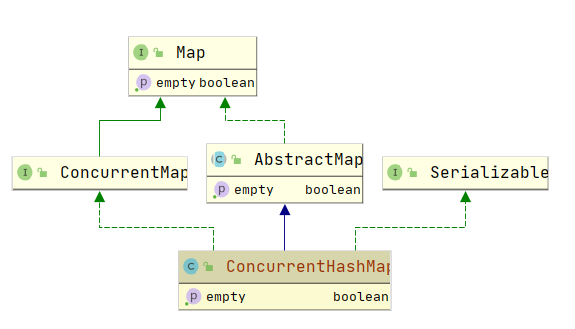

# java.util.concurrent.ConcurrentHashMap

## 一、简介

ConcurrentHashMap是HashMap的线程安全版本，内部也是使用（数组 + 链表 + 红黑树）的结构来存储元素。

相比于同样线程安全的HashTable来说，效率等各方面都有极大地提高。

## 二、继承体系



## 三、源码分析

### （一）构造方法

```java
public ConcurrentHashMap() {
}

public ConcurrentHashMap(int initialCapacity) {
    if (initialCapacity < 0)
        throw new IllegalArgumentException();
    // 如果初始化容量大于最大的一半，则取最大值。
    int cap = ((initialCapacity >= (MAXIMUM_CAPACITY >>> 1)) ?
            MAXIMUM_CAPACITY :
            tableSizeFor(initialCapacity + (initialCapacity >>> 1) + 1));
    this.sizeCtl = cap;
}

public ConcurrentHashMap(Map<? extends K, ? extends V> m) {
    this.sizeCtl = DEFAULT_CAPACITY;
    putAll(m);
}

public ConcurrentHashMap(int initialCapacity, float loadFactor) {
    this(initialCapacity, loadFactor, 1);
}

public ConcurrentHashMap(int initialCapacity,
                         float loadFactor, int concurrencyLevel) {
    if (!(loadFactor > 0.0f) || initialCapacity < 0 || concurrencyLevel <= 0)
        throw new IllegalArgumentException();
    if (initialCapacity < concurrencyLevel)   // Use at least as many bins
        initialCapacity = concurrencyLevel;   // as estimated threads
    long size = (long)(1.0 + (long)initialCapacity / loadFactor);
    int cap = (size >= (long)MAXIMUM_CAPACITY) ?
            MAXIMUM_CAPACITY : tableSizeFor((int)size);
    this.sizeCtl = cap;
}
```

==构造方法与HashMap对比可以发现，没有了 HashMap 中的 threshold 和 loadFactor，而是**改用了 sizeCtl 来控制**，而且只存储了容量在里面，值对应概念为：==

- `-1`，表示有线程正在进行初始化操作

- `-(1 + nThreads)`，表示有 n 个线程正在一起并行扩容

- `0`，默认值，后续在真正初始化的时候使用默认容量

- `>0`，初始化或扩容完成后下一次的**触发扩容门槛** 

从源码中可以看出，**ConcurrentHashMap 只允许一个线程进行初始化操作，当其它线程竞争失败(sizeCtl < 0)时便会进行自旋，直到竞争成功(初始化)线程完成初始化，那么此时table便不再为null，也就退出了while循环**。

Thread.yield方法用于提示CPU可以放弃当前线程的执行，当然这只是一个提示(hint)，这里对此方法的调用是一个优化手段。

对SIZECTL字段CAS更新的成功便标志者线程赢得了竞争，可以进行初始化工作了，剩下的就是一个数组的构造过程，一目了然。

### （二）添加元素：put()

整体流程跟HashMap比较类似，大致是以下几步：

- 如果桶数组未初始化，则初始化；
- 计算该 key 对应的 Hash 值
- ==如果待插入的元素所在的桶为空，则尝试把此元素直接插入到桶的第一个位置（使用 CAS 操作，只不过这里的旧值是为 null，CAS 成功则 break 跳出，反之如果里面已经有元素了则 CAS 失败，进入下一次循环进行重新操作）；==
- 如果正在扩容，则当前线程一起加入到扩容的过程中；
- ==如果待插入的元素所在的桶不为空且不在迁移元素，则使用 synchronized 锁住这个桶（分段锁）；==
- 如果当前桶中元素以链表方式存储，则在链表中寻找该元素或者插入元素；
- 如果当前桶中元素以红黑树方式存储，则在红黑树中寻找该元素或者插入元素；
- 如果元素存在，则返回旧值；
- 如果元素不存在，整个Map的元素个数加1，并检查是否需要扩容；

添加元素操作中使用的锁主要有（自旋锁 + CAS + synchronized + 分段锁）。

**注意点**： key 和 value 都不能为空；

```java
public V put(K key, V value) {
    return putVal(key, value, false);
}
// 最后一个参数为 onlyIfAbsent，表示只有在 key 对应的 value 不存在时才将 value 加入，所以 putVal是put和putIfAbsent两个方法的真正实现。
final V putVal(K key, V value, boolean onlyIfAbsent) {
    // key 和 value 都不能为 null
    if (key == null || value == null) throw new NullPointerException();
    // 计算 hash 值
    int hash = spread(key.hashCode());
    // 要插入的元素所在桶的元素个数
    int binCount = 0;
    // 死循环，结合 CAS 使用（如果 CAS 失败，则会重新取整个桶进行下面的流程）
    for (Node<K,V>[] tab = table;;) {
        Node<K,V> f; int n, i, fh;
        if (tab == null || (n = tab.length) == 0)
            // 步骤一：如果桶未初始化或者桶个数为 0，则初始化桶
            tab = initTable();
        else if ((f = tabAt(tab, i = (n - 1) & hash)) == null) {
            // 如果要插入的元素所在的桶还没有元素，则把这个元素插入到这个桶中
            if (casTabAt(tab, i, null,
                    new Node<K,V>(hash, key, value, null)))
                // 如果使用CAS插入元素时，发现已经有元素了，则进入下一次循环，重新操作
                // 如果使用CAS插入元素成功，则break跳出循环，流程结束
                break;                   // no lock when adding to empty bin
        }
        else if ((fh = f.hash) == MOVED)
            // 如果要插入的元素所在的桶的第一个元素的hash是MOVED，则当前线程帮忙一起迁移元素
            tab = helpTransfer(tab, f);
        else {
            // 如果这个桶不为空且不在迁移元素，则锁住这个桶（分段锁）
            // 并查找要插入的元素是否在这个桶中
            // 存在，则替换值（onlyIfAbsent=false）
            // 不存在，则插入到链表结尾或插入树中
            V oldVal = null;
            synchronized (f) {
                // 再次检测第一个元素是否有变化，如果有变化则进入下一次循环，从头来过
                if (tabAt(tab, i) == f) {
                    // 如果第一个元素的hash值大于等于0（说明不是在迁移，也不是树）
                    // 那就是桶中的元素使用的是链表方式存储
                    if (fh >= 0) {
                        // 桶中元素个数赋值为1
                        binCount = 1;
                        // 遍历整个桶，每次结束binCount加1
                        for (Node<K,V> e = f;; ++binCount) {
                            K ek;
                            if (e.hash == hash &&
                                    ((ek = e.key) == key ||
                                            (ek != null && key.equals(ek)))) {
                                // 如果找到了这个元素，则赋值了新值（onlyIfAbsent=false）
                                // 并退出循环
                                oldVal = e.val;
                                if (!onlyIfAbsent)
                                    e.val = value;
                                break;
                            }
                            Node<K,V> pred = e;
                            if ((e = e.next) == null) {
                                // 如果到链表尾部还没有找到元素
                                // 就把它插入到链表结尾并退出循环
                                pred.next = new Node<K,V>(hash, key,
                                        value, null);
                                break;
                            }
                        }
                    }
                    else if (f instanceof TreeBin) {
                        // 如果第一个元素是树节点
                        Node<K,V> p;
                        // 桶中元素个数赋值为2
                        binCount = 2;
                        // 调用红黑树的插入方法插入元素
                        // 如果成功插入则返回null
                        // 否则返回寻找到的节点
                        if ((p = ((TreeBin<K,V>)f).putTreeVal(hash, key,
                                value)) != null) {
                            // 如果找到了这个元素，则赋值了新值（onlyIfAbsent=false）
                            // 并退出循环
                            oldVal = p.val;
                            if (!onlyIfAbsent)
                                p.val = value;
                        }
                    }
                }
            }
            // 如果binCount不为0，说明成功插入了元素或者寻找到了元素
            if (binCount != 0) {
                // 如果链表元素个数达到了8，则尝试树化
                // 因为上面把元素插入到树中时，binCount只赋值了2，并没有计算整个树中元素的个数
                // 所以不会重复树化
                if (binCount >= TREEIFY_THRESHOLD)
                    treeifyBin(tab, i);
                // 如果要插入的元素已经存在，则返回旧值
                if (oldVal != null)
                    return oldVal;
                // 退出外层大循环，流程结束
                break;
            }
        }
        }
        // 成功插入元素，元素个数加1（是否要扩容在这个里面）
        addCount(1L, binCount);
        // 成功插入元素返回null
        return null;
    }
```


### （三）初始化桶数组

第一次放元素时，初始化桶数组。即如果table为空或大小为0，那么将对其进行初始化操作。

```java
private final Node<K,V>[] initTable() {
    Node<K,V>[] tab; int sc;
    while ((tab = table) == null || tab.length == 0) {
        if ((sc = sizeCtl) < 0)
            // 如果sizeCtl<0说明正在初始化或者扩容，让出CPU
            Thread.yield(); // lost initialization race; just spin
        else if (U.compareAndSwapInt(this, SIZECTL, sc, -1)) {
            // 如果把sizeCtl原子更新为-1成功，则当前线程进入初始化
            // 如果原子更新失败则说明有其它线程先一步进入初始化了，则进入下一次循环
            // 如果下一次循环时还没初始化完毕，则sizeCtl<0进入上面if的逻辑让出CPU
            // 如果下一次循环更新完毕了，则table.length!=0，退出循环
            try {
                // 再次检查table是否为空，防止ABA问题
                if ((tab = table) == null || tab.length == 0) {
                    // 如果sc为0则使用默认值16
                    int n = (sc > 0) ? sc : DEFAULT_CAPACITY;
                    // 新建数组
                    @SuppressWarnings("unchecked")
                    Node<K,V>[] nt = (Node<K,V>[])new Node<?,?>[n];
                    // 赋值给table桶数组
                    table = tab = nt;
                    // 设置sc为数组长度的0.75倍
                    // n - (n >>> 2) = n - n/4 = 0.75n
                    // 可见这里装载因子和扩容门槛都是写死了的
                    // 这也正是没有threshold和loadFactor属性的原因
                    sc = n - (n >>> 2);
                }
            } finally {
                // 把sc赋值给sizeCtl，这时存储的是扩容门槛
                sizeCtl = sc;
            }
            break;
        }
    }
    return tab;
}
```

（1）使用CAS锁控制只有一个线程初始化桶数组；

（2）sizeCtl在初始化后存储的是扩容门槛；

（3）扩容门槛写死的是桶数组大小的0.75倍，桶数组大小即map的容量，也就是最多存储多少个元素。

### 判断是否需要扩容

每次添加元素后，元素数量加1，并判断是否达到扩容门槛，达到了则进行扩容或协助扩容。

```java
private final void addCount(long x, int check) {
    CounterCell[] as; long b, s;
    // 这里使用的思想跟LongAdder类是一模一样的（后面会讲）
    // 把数组的大小存储根据不同的线程存储到不同的段上（也是分段锁的思想）
    // 并且有一个baseCount，优先更新baseCount，如果失败了再更新不同线程对应的段
    // 这样可以保证尽量小的减少冲突

    // 先尝试把数量加到baseCount上，如果失败再加到分段的CounterCell上
    if ((as = counterCells) != null ||
            !U.compareAndSwapLong(this, BASECOUNT, b = baseCount, s = b + x)) {
        CounterCell a; long v; int m;
        boolean uncontended = true;
        // 如果as为空
        // 或者长度为0
        // 或者当前线程所在的段为null
        // 或者在当前线程的段上加数量失败
        if (as == null || (m = as.length - 1) < 0 ||
                (a = as[ThreadLocalRandom.getProbe() & m]) == null ||
                !(uncontended =
                        U.compareAndSwapLong(a, CELLVALUE, v = a.value, v + x))) {
            // 强制增加数量（无论如何数量是一定要加上的，并不是简单地自旋）
            // 不同线程对应不同的段都更新失败了
            // 说明已经发生冲突了，那么就对counterCells进行扩容
            // 以减少多个线程hash到同一个段的概率
            fullAddCount(x, uncontended);
            return;
        }
        if (check <= 1)
            return;
        // 计算元素个数
        s = sumCount();
    }
    if (check >= 0) {
        Node<K,V>[] tab, nt; int n, sc;
        // 如果元素个数达到了扩容门槛，则进行扩容
        // 注意，正常情况下sizeCtl存储的是扩容门槛，即容量的0.75倍
        while (s >= (long)(sc = sizeCtl) && (tab = table) != null &&
                (n = tab.length) < MAXIMUM_CAPACITY) {
            // rs是扩容时的一个邮戳标识
            int rs = resizeStamp(n);
            if (sc < 0) {
                // sc<0说明正在扩容中
                if ((sc >>> RESIZE_STAMP_SHIFT) != rs || sc == rs + 1 ||
                        sc == rs + MAX_RESIZERS || (nt = nextTable) == null ||
                        transferIndex <= 0)
                    // 扩容已经完成了，退出循环
                    // 正常应该只会触发nextTable==null这个条件，其它条件没看出来何时触发
                    break;

                // 扩容未完成，则当前线程加入迁移元素中
                // 并把扩容线程数加1
                if (U.compareAndSwapInt(this, SIZECTL, sc, sc + 1))
                    transfer(tab, nt);
            }
            else if (U.compareAndSwapInt(this, SIZECTL, sc,
                    (rs << RESIZE_STAMP_SHIFT) + 2))
                // 这里是触发扩容的那个线程进入的地方
                // sizeCtl的高16位存储着rs这个扩容邮戳
                // sizeCtl的低16位存储着扩容线程数加1，即(1+nThreads)
                // 所以官方说的扩容时sizeCtl的值为 -(1+nThreads)是错误的

                // 进入迁移元素
                transfer(tab, null);
            // 重新计算元素个数
            s = sumCount();
        }
    }
}
```

（1）元素个数的存储方式类似于LongAdder类，存储在不同的段上，减少不同线程同时更新size时的冲突；

（2）计算元素个数时把这些段的值及baseCount相加算出总的元素个数；

（3）正常情况下sizeCtl存储着扩容门槛，扩容门槛为容量的0.75倍；

（4）扩容时sizeCtl高位存储扩容邮戳(resizeStamp)，低位存储扩容线程数加1（1+nThreads）；

（5）其它线程添加元素后如果发现存在扩容，也会加入的扩容行列中来；

### 协助扩容（迁移元素）

线程添加元素时发现正在扩容且当前元素所在的桶元素已经迁移完成了，则协助迁移其它桶的元素。

```java
final Node<K,V>[] helpTransfer(Node<K,V>[] tab, Node<K,V> f) {
    Node<K,V>[] nextTab; int sc;
    // 如果桶数组不为空，并且当前桶第一个元素为ForwardingNode类型，并且nextTab不为空
    // 说明当前桶已经迁移完毕了，才去帮忙迁移其它桶的元素
    // 扩容时会把旧桶的第一个元素置为ForwardingNode，并让其nextTab指向新桶数组
    if (tab != null && (f instanceof ForwardingNode) &&
            (nextTab = ((ForwardingNode<K,V>)f).nextTable) != null) {
        int rs = resizeStamp(tab.length);
        // sizeCtl<0，说明正在扩容
        while (nextTab == nextTable && table == tab &&
                (sc = sizeCtl) < 0) {
            if ((sc >>> RESIZE_STAMP_SHIFT) != rs || sc == rs + 1 ||
                    sc == rs + MAX_RESIZERS || transferIndex <= 0)
                break;
            // 扩容线程数加1
            if (U.compareAndSwapInt(this, SIZECTL, sc, sc + 1)) {
                // 当前线程帮忙迁移元素
                transfer(tab, nextTab);
                break;
            }
        }
        return nextTab;
    }
    return table;
}
```

当前桶元素迁移完成了才去协助迁移其它桶元素；

### 迁移元素

扩容时容量变为两倍，并把部分元素迁移到其它桶中。

```java
private final void transfer(Node<K,V>[] tab, Node<K,V>[] nextTab) {
    int n = tab.length, stride;
    if ((stride = (NCPU > 1) ? (n >>> 3) / NCPU : n) < MIN_TRANSFER_STRIDE)
        stride = MIN_TRANSFER_STRIDE; // subdivide range
    if (nextTab == null) {            // initiating
        // 如果nextTab为空，说明还没开始迁移
        // 就新建一个新桶数组
        try {
            // 新桶数组是原桶的两倍
            @SuppressWarnings("unchecked")
            Node<K,V>[] nt = (Node<K,V>[])new Node<?,?>[n << 1];
            nextTab = nt;
        } catch (Throwable ex) {      // try to cope with OOME
            sizeCtl = Integer.MAX_VALUE;
            return;
        }
        nextTable = nextTab;
        transferIndex = n;
    }
    // 新桶数组大小
    int nextn = nextTab.length;
    // 新建一个ForwardingNode类型的节点，并把新桶数组存储在里面
    ForwardingNode<K,V> fwd = new ForwardingNode<K,V>(nextTab);
    boolean advance = true;
    boolean finishing = false; // to ensure sweep before committing nextTab
    for (int i = 0, bound = 0;;) {
        Node<K,V> f; int fh;
        // 整个while循环就是在算i的值，过程太复杂，不用太关心
        // i的值会从n-1依次递减，感兴趣的可以打下断点就知道了
        // 其中n是旧桶数组的大小，也就是说i从15开始一直减到1这样去迁移元素
        while (advance) {
            int nextIndex, nextBound;
            if (--i >= bound || finishing)
                advance = false;
            else if ((nextIndex = transferIndex) <= 0) {
                i = -1;
                advance = false;
            }
            else if (U.compareAndSwapInt
                    (this, TRANSFERINDEX, nextIndex,
                            nextBound = (nextIndex > stride ?
                                    nextIndex - stride : 0))) {
                bound = nextBound;
                i = nextIndex - 1;
                advance = false;
            }
        }
        if (i < 0 || i >= n || i + n >= nextn) {
            // 如果一次遍历完成了
            // 也就是整个map所有桶中的元素都迁移完成了
            int sc;
            if (finishing) {
                // 如果全部迁移完成了，则替换旧桶数组
                // 并设置下一次扩容门槛为新桶数组容量的0.75倍
                nextTable = null;
                table = nextTab;
                sizeCtl = (n << 1) - (n >>> 1);
                return;
            }
            if (U.compareAndSwapInt(this, SIZECTL, sc = sizeCtl, sc - 1)) {
                // 当前线程扩容完成，把扩容线程数-1
                if ((sc - 2) != resizeStamp(n) << RESIZE_STAMP_SHIFT)
                    // 扩容完成两边肯定相等
                    return;
                // 把finishing设置为true
                // finishing为true才会走到上面的if条件
                finishing = advance = true;
                // i重新赋值为n
                // 这样会再重新遍历一次桶数组，看看是不是都迁移完成了
                // 也就是第二次遍历都会走到下面的(fh = f.hash) == MOVED这个条件
                i = n; // recheck before commit
            }
        }
        else if ((f = tabAt(tab, i)) == null)
            // 如果桶中无数据，直接放入ForwardingNode标记该桶已迁移
            advance = casTabAt(tab, i, null, fwd);
        else if ((fh = f.hash) == MOVED)
            // 如果桶中第一个元素的hash值为MOVED
            // 说明它是ForwardingNode节点
            // 也就是该桶已迁移
            advance = true; // already processed
        else {
            // 锁定该桶并迁移元素
            synchronized (f) {
                // 再次判断当前桶第一个元素是否有修改
                // 也就是可能其它线程先一步迁移了元素
                if (tabAt(tab, i) == f) {
                    // 把一个链表分化成两个链表
                    // 规则是桶中各元素的hash与桶大小n进行与操作
                    // 等于0的放到低位链表(low)中，不等于0的放到高位链表(high)中
                    // 其中低位链表迁移到新桶中的位置相对旧桶不变
                    // 高位链表迁移到新桶中位置正好是其在旧桶的位置加n
                    // 这也正是为什么扩容时容量在变成两倍的原因
                    Node<K,V> ln, hn;
                    if (fh >= 0) {
                        // 第一个元素的hash值大于等于0
                        // 说明该桶中元素是以链表形式存储的
                        // 这里与HashMap迁移算法基本类似
                        // 唯一不同的是多了一步寻找lastRun
                        // 这里的lastRun是提取出链表后面不用处理再特殊处理的子链表
                        // 比如所有元素的hash值与桶大小n与操作后的值分别为 0 0 4 4 0 0 0
                        // 则最后后面三个0对应的元素肯定还是在同一个桶中
                        // 这时lastRun对应的就是倒数第三个节点
                        // 至于为啥要这样处理，我也没太搞明白
                        int runBit = fh & n;
                        Node<K,V> lastRun = f;
                        for (Node<K,V> p = f.next; p != null; p = p.next) {
                            int b = p.hash & n;
                            if (b != runBit) {
                                runBit = b;
                                lastRun = p;
                            }
                        }
                        // 看看最后这几个元素归属于低位链表还是高位链表
                        if (runBit == 0) {
                            ln = lastRun;
                            hn = null;
                        }
                        else {
                            hn = lastRun;
                            ln = null;
                        }
                        // 遍历链表，把hash&n为0的放在低位链表中
                        // 不为0的放在高位链表中
                        for (Node<K,V> p = f; p != lastRun; p = p.next) {
                            int ph = p.hash; K pk = p.key; V pv = p.val;
                            if ((ph & n) == 0)
                                ln = new Node<K,V>(ph, pk, pv, ln);
                            else
                                hn = new Node<K,V>(ph, pk, pv, hn);
                        }
                        // 低位链表的位置不变
                        setTabAt(nextTab, i, ln);
                        // 高位链表的位置是原位置加n
                        setTabAt(nextTab, i + n, hn);
                        // 标记当前桶已迁移
                        setTabAt(tab, i, fwd);
                        // advance为true，返回上面进行--i操作
                        advance = true;
                    }
                    else if (f instanceof TreeBin) {
                        // 如果第一个元素是树节点
                        // 也是一样，分化成两颗树
                        // 也是根据hash&n为0放在低位树中
                        // 不为0放在高位树中
                        TreeBin<K,V> t = (TreeBin<K,V>)f;
                        TreeNode<K,V> lo = null, loTail = null;
                        TreeNode<K,V> hi = null, hiTail = null;
                        int lc = 0, hc = 0;
                        // 遍历整颗树，根据hash&n是否为0分化成两颗树
                        for (Node<K,V> e = t.first; e != null; e = e.next) {
                            int h = e.hash;
                            TreeNode<K,V> p = new TreeNode<K,V>
                                    (h, e.key, e.val, null, null);
                            if ((h & n) == 0) {
                                if ((p.prev = loTail) == null)
                                    lo = p;
                                else
                                    loTail.next = p;
                                loTail = p;
                                ++lc;
                            }
                            else {
                                if ((p.prev = hiTail) == null)
                                    hi = p;
                                else
                                    hiTail.next = p;
                                hiTail = p;
                                ++hc;
                            }
                        }
                        // 如果分化的树中元素个数小于等于6，则退化成链表
                        ln = (lc <= UNTREEIFY_THRESHOLD) ? untreeify(lo) :
                                (hc != 0) ? new TreeBin<K,V>(lo) : t;
                        hn = (hc <= UNTREEIFY_THRESHOLD) ? untreeify(hi) :
                                (lc != 0) ? new TreeBin<K,V>(hi) : t;
                        // 低位树的位置不变
                        setTabAt(nextTab, i, ln);
                        // 高位树的位置是原位置加n
                        setTabAt(nextTab, i + n, hn);
                        // 标记该桶已迁移
                        setTabAt(tab, i, fwd);
                        // advance为true，返回上面进行--i操作
                        advance = true;
                    }
                }
            }
        }
    }
}
```

（1）新桶数组大小是旧桶数组的两倍；

（2）迁移元素先从靠后的桶开始；

（3）迁移完成的桶在里面放置一ForwardingNode类型的元素，标记该桶迁移完成；

（4）迁移时根据hash&n是否等于0把桶中元素分化成两个链表或树；

（5）低位链表（树）存储在原来的位置；

（6）高们链表（树）存储在原来的位置加n的位置；

（7）迁移元素时会锁住当前桶，也是分段锁的思想；


---

### 删除元素

删除元素跟添加元素一样，都是先找到元素所在的桶，然后采用分段锁的思想锁住整个桶，再进行操作。

```java
public V remove(Object key) {
    // 调用替换节点方法
    return replaceNode(key, null, null);
}

final V replaceNode(Object key, V value, Object cv) {
    // 计算hash
    int hash = spread(key.hashCode());
    // 自旋
    for (Node<K,V>[] tab = table;;) {
        Node<K,V> f; int n, i, fh;
        if (tab == null || (n = tab.length) == 0 ||
                (f = tabAt(tab, i = (n - 1) & hash)) == null)
            // 如果目标key所在的桶不存在，跳出循环返回null
            break;
        else if ((fh = f.hash) == MOVED)
            // 如果正在扩容中，协助扩容
            tab = helpTransfer(tab, f);
        else {
            V oldVal = null;
            // 标记是否处理过
            boolean validated = false;
            synchronized (f) {
                // 再次验证当前桶第一个元素是否被修改过
                if (tabAt(tab, i) == f) {
                    if (fh >= 0) {
                        // fh>=0表示是链表节点
                        validated = true;
                        // 遍历链表寻找目标节点
                        for (Node<K,V> e = f, pred = null;;) {
                            K ek;
                            if (e.hash == hash &&
                                    ((ek = e.key) == key ||
                                            (ek != null && key.equals(ek)))) {
                                // 找到了目标节点
                                V ev = e.val;
                                // 检查目标节点旧value是否等于cv
                                if (cv == null || cv == ev ||
                                        (ev != null && cv.equals(ev))) {
                                    oldVal = ev;
                                    if (value != null)
                                        // 如果value不为空则替换旧值
                                        e.val = value;
                                    else if (pred != null)
                                        // 如果前置节点不为空
                                        // 删除当前节点
                                        pred.next = e.next;
                                    else
                                        // 如果前置节点为空
                                        // 说明是桶中第一个元素，删除之
                                        setTabAt(tab, i, e.next);
                                }
                                break;
                            }
                            pred = e;
                            // 遍历到链表尾部还没找到元素，跳出循环
                            if ((e = e.next) == null)
                                break;
                        }
                    }
                    else if (f instanceof TreeBin) {
                        // 如果是树节点
                        validated = true;
                        TreeBin<K,V> t = (TreeBin<K,V>)f;
                        TreeNode<K,V> r, p;
                        // 遍历树找到了目标节点
                        if ((r = t.root) != null &&
                                (p = r.findTreeNode(hash, key, null)) != null) {
                            V pv = p.val;
                            // 检查目标节点旧value是否等于cv
                            if (cv == null || cv == pv ||
                                    (pv != null && cv.equals(pv))) {
                                oldVal = pv;
                                if (value != null)
                                    // 如果value不为空则替换旧值
                                    p.val = value;
                                else if (t.removeTreeNode(p))
                                    // 如果value为空则删除元素
                                    // 如果删除后树的元素个数较少则退化成链表
                                    // t.removeTreeNode(p)这个方法返回true表示删除节点后树的元素个数较少
                                    setTabAt(tab, i, untreeify(t.first));
                            }
                        }
                    }
                }
            }
            // 如果处理过，不管有没有找到元素都返回
            if (validated) {
                // 如果找到了元素，返回其旧值
                if (oldVal != null) {
                    // 如果要替换的值为空，元素个数减1
                    if (value == null)
                        addCount(-1L, -1);
                    return oldVal;
                }
                break;
            }
        }
    }
    // 没找到元素返回空
    return null;
}
```

（1）计算hash；

（2）如果所在的桶不存在，表示没有找到目标元素，返回；

（3）如果正在扩容，则协助扩容完成后再进行删除操作；

（4）如果是以链表形式存储的，则遍历整个链表查找元素，找到之后再删除；

（5）如果是以树形式存储的，则遍历树查找元素，找到之后再删除；

（6）如果是以树形式存储的，删除元素之后树较小，则退化成链表；

（7）如果确实删除了元素，则整个map元素个数减1，并返回旧值；

（8）如果没有删除元素，则返回null；

### 获取元素

获取元素，根据目标key所在桶的第一个元素的不同采用不同的方式获取元素，关键点在于find()方法的重写。

```java
public V get(Object key) {
    Node<K,V>[] tab; Node<K,V> e, p; int n, eh; K ek;
    // 计算hash
    int h = spread(key.hashCode());
    // 如果元素所在的桶存在且里面有元素
    if ((tab = table) != null && (n = tab.length) > 0 &&
            (e = tabAt(tab, (n - 1) & h)) != null) {
        // 如果第一个元素就是要找的元素，直接返回
        if ((eh = e.hash) == h) {
            if ((ek = e.key) == key || (ek != null && key.equals(ek)))
                return e.val;
        }
        else if (eh < 0)
            // hash小于0，说明是树或者正在扩容
            // 使用find寻找元素，find的寻找方式依据Node的不同子类有不同的实现方式
            return (p = e.find(h, key)) != null ? p.val : null;

        // 遍历整个链表寻找元素
        while ((e = e.next) != null) {
            if (e.hash == h &&
                    ((ek = e.key) == key || (ek != null && key.equals(ek))))
                return e.val;
        }
    }
    return null;
}
```

（1）hash到元素所在的桶；

（2）如果桶中第一个元素就是该找的元素，直接返回；

（3）如果是树或者正在迁移元素，则调用各自Node子类的find()方法寻找元素；

（4）如果是链表，遍历整个链表寻找元素；

（5）获取元素没有加锁；

### 获取元素个数

元素个数的存储也是采用分段的思想，获取元素个数时需要把所有段加起来。

```java
public int size() {
    // 调用sumCount()计算元素个数
    long n = sumCount();
    return ((n < 0L) ? 0 :
            (n > (long)Integer.MAX_VALUE) ? Integer.MAX_VALUE :
                    (int)n);
}

final long sumCount() {
    // 计算CounterCell所有段及baseCount的数量之和
    CounterCell[] as = counterCells; CounterCell a;
    long sum = baseCount;
    if (as != null) {
        for (int i = 0; i < as.length; ++i) {
            if ((a = as[i]) != null)
                sum += a.value;
        }
    }
    return sum;
}
```

（1）元素的个数依据不同的线程存在在不同的段里；（见addCounter()分析）

（2）计算CounterCell所有段及baseCount的数量之和；

（3）获取元素个数没有加锁；

## 总结

（1）ConcurrentHashMap是HashMap的线程安全版本；

（2）ConcurrentHashMap采用（数组 + 链表 + 红黑树）的结构存储元素；

（3）ConcurrentHashMap相比于同样线程安全的HashTable，效率要高很多；

（4）ConcurrentHashMap采用的锁有 synchronized，CAS，自旋锁，分段锁，volatile等；

（5）ConcurrentHashMap中没有threshold和loadFactor这两个字段，而是采用sizeCtl来控制；

（6）sizeCtl = -1，表示正在进行初始化；

（7）sizeCtl = 0，默认值，表示后续在真正初始化的时候使用默认容量；

（8）sizeCtl > 0，在初始化之前存储的是传入的容量，在初始化或扩容后存储的是下一次的扩容门槛；

（9）sizeCtl = (resizeStamp << 16) + (1 + nThreads)，表示正在进行扩容，高位存储扩容邮戳，低位存储扩容线程数加1；

（10）更新操作时如果正在进行扩容，当前线程协助扩容；

（11）==更新操作会采用synchronized锁住当前桶的第一个元素，这是分段锁的思想；==

（12）==整个扩容过程都是通过CAS控制sizeCtl这个字段来进行的，这很关键；==

（13）迁移完元素的桶会放置一个ForwardingNode节点，以标识该桶迁移完毕；

（14）元素个数的存储也是采用的分段思想，类似于LongAdder的实现；

（15）元素个数的更新会把不同的线程hash到不同的段上，减少资源争用；

（16）元素个数的更新如果还是出现多个线程同时更新一个段，则会扩容段（CounterCell）；

（17）获取元素个数是把所有的段（包括baseCount和CounterCell）相加起来得到的；

（18）==查询操作是不会加锁的，所以ConcurrentHashMap不是强一致性的；==

（19）ConcurrentHashMap中不能存储key或value为null的元素；

## 彩蛋——值得学习的技术

ConcurrentHashMap中有哪些值得学习的技术呢？

我认为有以下几点：

（1）CAS + 自旋，乐观锁的思想，减少线程上下文切换的时间；

（2）分段锁的思想，减少同一把锁争用带来的低效问题；

（3）CounterCell，分段存储元素个数，减少多线程同时更新一个字段带来的低效；

（4）@sun.misc.Contended（CounterCell上的注解），避免伪共享；（p.s.伪共享我们后面也会讲的^^）

（5）多线程协同进行扩容；

（6）你又学到了哪些呢？

## 彩蛋——不能解决的问题

ConcurrentHashMap不能解决什么问题呢？

请看下面的例子：

```java
private static final Map<Integer, Integer> map = new ConcurrentHashMap<>();

public void unsafeUpdate(Integer key, Integer value) {
    Integer oldValue = map.get(key);
    if (oldValue == null) {
        map.put(key, value);
    }
}
```

这里如果有多个线程同时调用unsafeUpdate()这个方法，ConcurrentHashMap还能保证线程安全吗？

答案是不能。因为get()之后if之前可能有其它线程已经put()了这个元素，这时候再put()就把那个线程put()的元素覆盖了。

那怎么修改呢？

答案也很简单，使用putIfAbsent()方法，它会保证元素不存在时才插入元素，如下：

```java
public void safeUpdate(Integer key, Integer value) {
    map.putIfAbsent(key, value);
}
```

那么，如果上面oldValue不是跟null比较，而是跟一个特定的值比如1进行比较怎么办？也就是下面这样：

```java
public void unsafeUpdate(Integer key, Integer value) {
    Integer oldValue = map.get(key);
    if (oldValue == 1) {
        map.put(key, value);
    }
}
```

这样的话就没办法使用putIfAbsent()方法了。

其实，ConcurrentHashMap还提供了另一个方法叫replace(K key, V oldValue, V newValue)可以解决这个问题。

replace(K key, V oldValue, V newValue)这个方法可不能乱用，如果传入的newValue是null，则会删除元素。

```java
public void safeUpdate(Integer key, Integer value) {
    map.replace(key, 1, value);
}
```

那么，如果if之后不是简单的put()操作，而是还有其它业务操作，之后才是put()，比如下面这样，这该怎么办呢？

```java
public void unsafeUpdate(Integer key, Integer value) {
    Integer oldValue = map.get(key);
    if (oldValue == 1) {
        System.out.println(System.currentTimeMillis());
        /**
         * 其它业务操作
         */
        System.out.println(System.currentTimeMillis());
      
        map.put(key, value);
    }
}
```

这时候就没办法使用ConcurrentHashMap提供的方法了，只能业务自己来保证线程安全了，比如下面这样：

```java
public void safeUpdate(Integer key, Integer value) {
    synchronized (map) {
        Integer oldValue = map.get(key);
        if (oldValue == null) {
            System.out.println(System.currentTimeMillis());
            /**
             * 其它业务操作
             */
            System.out.println(System.currentTimeMillis());

            map.put(key, value);
        }
    }
}
```

这样虽然不太友好，但是最起码能保证业务逻辑是正确的。

当然，这里使用ConcurrentHashMap的意义也就不大了，可以换成普通的HashMap了。

上面只是举一个简单的例子，我们不能听说ConcurrentHashMap是线程安全的，就认为它无论什么情况下都是线程安全的，还是那句话尽信书不如无书。

这也正是我们读源码的目的之一，了解其本质，才能在我们的实际工作中少挖坑，不论是挖给别人还是挖给自己^^。


#######################################################################################

我们对JDK1.8版本的ConcurrentHashMap进行说明，1.8版本的ConcurrentHashMap相比之前的版本主要做了两处改进:

- 使用CAS代替分段锁。
- 红黑树，这一点和HashMap是一致的。


# put

最核心的便是put方法:

```java
public V put(K key, V value) {
    return putVal(key, value, false);
}
```

最后一个参数为onlyIfAbsent，表示只有在key对应的value不存在时才将value加入，所以putVal是put和putIfAbsent两个方法的真正实现。

```java
final V putVal(K key, V value, boolean onlyIfAbsent) {
    if (key == null || value == null) throw new NullPointerException();
    int hash = spread(key.hashCode());
    int binCount = 0;
    //volatile读
    for (Node<K,V>[] tab = table;;) {
        Node<K,V> f; int n, i, fh;
        if (tab == null || (n = tab.length) == 0)
            //初始化
            tab = initTable();
        else if ((f = tabAt(tab, i = (n - 1) & hash)) == null) {
            if (casTabAt(tab, i, null,
                         new Node<K,V>(hash, key, value, null)))
                break;                   // no lock when adding to empty bin
        }
        else if ((fh = f.hash) == MOVED)
            tab = helpTransfer(tab, f);
        else {
            //节点添加
            V oldVal = null;
            synchronized (f) {
                if (tabAt(tab, i) == f) {
                    if (fh >= 0) {
                        binCount = 1;
                        for (Node<K,V> e = f;; ++binCount) {
                            K ek;
                            if (e.hash == hash &&
                                ((ek = e.key) == key ||
                                 (ek != null && key.equals(ek)))) {
                                oldVal = e.val;
                                if (!onlyIfAbsent)
                                    e.val = value;
                                break;
                            }
                            Node<K,V> pred = e;
                            if ((e = e.next) == null) {
                                pred.next = new Node<K,V>(hash, key, value, null);
                                break;
                            }
                        }
                    }
                    else if (f instanceof TreeBin) {
                        Node<K,V> p;
                        binCount = 2;
                        if ((p = ((TreeBin<K,V>)f).putTreeVal(hash, key, value)) != null) {
                            oldVal = p.val;
                            if (!onlyIfAbsent)
                                p.val = value;
                        }
                    }
                }
            }
            if (binCount != 0) {
                if (binCount >= TREEIFY_THRESHOLD)
                    treeifyBin(tab, i);
                if (oldVal != null)
                    return oldVal;
                break;
            }
        }
    }
    addCount(1L, binCount);
    return null;
}
```

table便是其数据的存放载体:

```java
transient volatile Node<K,V>[] table;
```

它是volatile的。

## 初始化

如果table为空或大小为0，那么将对其进行初始化操作，initTable:

```java
private final Node<K,V>[] initTable() {
    Node<K,V>[] tab; int sc;
    //volatile读
    while ((tab = table) == null || tab.length == 0) {
        //volatile读
        if ((sc = sizeCtl) < 0)
            Thread.yield(); // lost initialization race; just spin
        else if (U.compareAndSwapInt(this, SIZECTL, sc, -1)) {
            try {
                if ((tab = table) == null || tab.length == 0) {
                    int n = (sc > 0) ? sc : DEFAULT_CAPACITY;
                    Node<K,V>[] nt = (Node<K,V>[])new Node<?,?>[n];
                    table = tab = nt;
                    //sizeCtl设为当前大小的3 / 4
                    sc = n - (n >>> 2);
                }
            } finally {
                sizeCtl = sc;
            }
            break;
        }
    }
    return tab;
}
```

sizeCtl是ConcurrentHashMap的初始化，扩容操作中一个至关重要的控制变量，其声明:

```java
private transient volatile int sizeCtl;
```

其取值可能为:

- 0: 初始值。


- -1: 正在进行初始化。
- 负值(小于-1): 表示正在进行扩容，因为ConcurrentHashMap支持多线程并行扩容。
- 正数: 表示下一次触发扩容的临界值大小，即当前值 * 0.75(负载因子)。

从源码中可以看出，ConcurrentHashMap只允许一个线程进行初始化操作，当其它线程竞争失败(sizeCtl < 0)时便会进行自旋，直到竞争成功(初始化)线程完成初始化，那么此时table便不再为null，也就退出了while循环。

Thread.yield方法用于提示CPU可以放弃当前线程的执行，当然这只是一个提示(hint)，这里对此方法的调用是一个优化手段。

对SIZECTL字段CAS更新的成功便标志者线程赢得了竞争，可以进行初始化工作了，剩下的就是一个数组的构造过程，一目了然。

## 头结点设置

如果key对应的bin为空，那么我们只需要将给定的节点 设为头结点即可，这里对应putVal源码中的下面的部分:

```java
else if ((f = tabAt(tab, i = (n - 1) & hash)) == null) {
    if (casTabAt(tab, i, null, new Node<K,V>(hash, key, value, null)))
        break;
}
```

这里tabAt是一次volatile读，casTabAt为CAS操作。

## 节点添加

如果key对应的bin不为 null，那么就说明需要进行节点添加，从源码可以看出，这里对bin的头结点进行了加锁操作。我的理解为，这里需要**遍历整个链表或搜索红黑树以判断给定的节点(值)是否已存在，同时需要记录链表节点的个数，以决定是否需要将其转化为红黑树**。

## 转为红黑树

指putVal源码中的:

```java
if (binCount != 0) {
    if (binCount >= TREEIFY_THRESHOLD)
        treeifyBin(tab, i);
    if (oldVal != null)
        return oldVal;
    break;
}
```

注意，这段代码是在上述(节点添加部分)同步代码块之外执行的。

TREEIFY_THRESHOLD表示将链表转为红黑树的链表长度的临界值，默认为8.

```java
private final void treeifyBin(Node<K,V>[] tab, int index) {
    Node<K,V> b; int n, sc;
    if (tab != null) {
        if ((n = tab.length) < MIN_TREEIFY_CAPACITY)
            //扩容
            tryPresize(n << 1);
        else if ((b = tabAt(tab, index)) != null && b.hash >= 0) {
            synchronized (b) {
                if (tabAt(tab, index) == b) {
                    TreeNode<K,V> hd = null, tl = null;
                    for (Node<K,V> e = b; e != null; e = e.next) {
                        TreeNode<K,V> p = new TreeNode<K,V>(e.hash, e.key, e.val, null, null);
                        if ((p.prev = tl) == null)
                            hd = p;
                        else
                            tl.next = p;
                        tl = p;
                    }
                    setTabAt(tab, index, new TreeBin<K,V>(hd));
                }
            }
        }
    }
}
```

### 扩容

如果当前bin的个数未达到MIN_TREEIFY_CAPACITY，那么不再转为红黑树，转而进行扩容。MIN_TREEIFY_CAPACITY默认为64.tryPresize:

```java
private final void tryPresize(int size) {
    int c = (size >= (MAXIMUM_CAPACITY >>> 1)) ? MAXIMUM_CAPACITY :
        tableSizeFor(size + (size >>> 1) + 1);
    int sc;
    //volatile读，没有正在进行初始化或扩容的操作
    while ((sc = sizeCtl) >= 0) {
        Node<K,V>[] tab = table; int n;
        //这里实际上进行了初始化工作
        if (tab == null || (n = tab.length) == 0) {
            n = (sc > c) ? sc : c;
            if (U.compareAndSwapInt(this, SIZECTL, sc, -1)) {
                try {
                    if (table == tab) {
                        Node<K,V>[] nt = (Node<K,V>[])new Node<?,?>[n];
                        table = nt;
                        sc = n - (n >>> 2);
                    }
                } finally {
                    sizeCtl = sc;
                }
            }
        }
        //已达到最大值，无法再进行扩容
        else if (c <= sc || n >= MAXIMUM_CAPACITY)
            break;
        else if (tab == table) {
            int rs = resizeStamp(n);
            if (sc < 0) {
                //竞争失败
                Node<K,V>[] nt;
                //判断是否已经完成
                if ((sc >>> RESIZE_STAMP_SHIFT) != rs || sc == rs + 1 ||
                    sc == rs + MAX_RESIZERS || (nt = nextTable) == null || transferIndex <= 0)
                    break;
                if (U.compareAndSwapInt(this, SIZECTL, sc, sc + 1))
                    transfer(tab, nt);
            }
            //竞争成功
            else if (U.compareAndSwapInt(this, SIZECTL, sc, (rs << RESIZE_STAMP_SHIFT) + 2))
                transfer(tab, null);
        }
    }
}
```

前面提到过了，ConcurrentHashMap支持多线程并行扩容，具体来说，是支持**多线程将节点从老的数组拷贝到新的数组**，而新数组创建仍是一个线程完成(不然多个线程创建多个对象，最后只使用一个，这不是浪费是什么?)

竞争成功的线程为transfer方法的nextTab参数传入null，这将导致新数组的创建。竞争失败的线程将会判断当前节点转移工作是否已经完成，如果已经完成，那么意味着扩容的完成，退出即可，如果没有完成，那么此线程将会进行辅助转移。

判断是否已经完成的条件只能理解(nt = nextTable) == null || transferIndex <= 0两个。

#### 转移

```java
private final void transfer(Node<K,V>[] tab, Node<K,V>[] nextTab) {
    int n = tab.length, stride;
    //1. 分片
    if ((stride = (NCPU > 1) ? (n >>> 3) / NCPU : n) < MIN_TRANSFER_STRIDE)
        stride = MIN_TRANSFER_STRIDE; // subdivide range
    //nextTab初始化，CAS保证了只会有一个线程执行这里的代码
    if (nextTab == null) {
        try {
            Node<K,V>[] nt = (Node<K,V>[])new Node<?,?>[n << 1];
            nextTab = nt;
        } catch (Throwable ex) {      // try to cope with OOME
            sizeCtl = Integer.MAX_VALUE;
            return;
        }
        nextTable = nextTab;
        transferIndex = n;
    }
    int nextn = nextTab.length;
    ForwardingNode<K,V> fwd = new ForwardingNode<K,V>(nextTab);
    boolean advance = true;
    boolean finishing = false; // to ensure sweep before committing nextTab
    for (int i = 0, bound = 0;;) {
        Node<K,V> f; int fh;
        while (advance) {
            int nextIndex, nextBound;
            //分片的最大下标i实际上就是在这里完成减一的，因为从下面可以看出，每处理完一个桶位便将advance设为true			 //从而便又进入了内层循环，但是注意，当最后一次(即bound)处理完成时，i会被再次减一，从而导致进入下面的			//分支再次读取transferIndex，这就说明了转移线程会在转移完一个分片后继续尝试剩余的分片(桶位)
            if (--i >= bound || finishing)
                advance = false;
            else if ((nextIndex = transferIndex) <= 0) {
                //所有bin均转移完毕
                i = -1;
                advance = false;
            }
            //申请分片
            else if (U.compareAndSwapInt
                     (this, TRANSFERINDEX, nextIndex,
                      nextBound = (nextIndex > stride ? nextIndex - stride : 0))) {
                //bound表示此分片的截止(最小)下标
                bound = nextBound;
                //i表示此分片的最大下标
                i = nextIndex - 1;
                //advance意为前进，跳出内层循环
                advance = false;
            }
        }
        if (i < 0 || i >= n || i + n >= nextn) {
            //进入到这里就意味着所有的桶位都已被处理完毕或是被包含在某个转移线程的申请分片中(即待转移)
            int sc;
            if (finishing) {
                //进行收尾工作，此工作一定是由最后一个分片申请线程进行的，这里用volatile写将nextTable置为null
                //，table指向新数组
                nextTable = null;
                table = nextTab;
                //sizeCtl设为新数组大小的3 / 4
                sizeCtl = (n << 1) - (n >>> 1);
                return;
            }
            //转移线程开始转移之前会将sizeCtl自增，转移完成之后自减，所以判断转移是否已经完成的方式便是sizeCtl是			  //否等于初始值
            if (U.compareAndSwapInt(this, SIZECTL, sc = sizeCtl, sc - 1)) {
                if ((sc - 2) != resizeStamp(n) << RESIZE_STAMP_SHIFT)
                    //还有其它线程尚未转移完成，直接退出，将收尾工作交给最后完成的那个线程
                    return;
                //进行到这里就说明当前线程为最后一个完成的线程，有意思的是这里又将advance置为true且i置为n(原)
                //数组的大小，作用就是最后再全部扫描一遍所有的桶位，看是否还有漏网之鱼
                finishing = advance = true;
                i = n;
            }
        }
        else if ((f = tabAt(tab, i)) == null)
            //2.
            advance = casTabAt(tab, i, null, fwd);
        else if ((fh = f.hash) == MOVED)
            advance = true; // already processed
        else {
            synchronized (f) {
                //3. 转移算法
                //双重检查
                if (tabAt(tab, i) == f) {
                    Node<K,V> ln, hn;
                    if (fh >= 0) {
                        //runBit代表了当前桶位是否需要移动
                        int runBit = fh & n;
                        Node<K,V> lastRun = f;
                        //这里是找出最后一个和头结点的移动属性相同的
                        for (Node<K,V> p = f.next; p != null; p = p.next) {
                            int b = p.hash & n;
                            if (b != runBit) {
                                runBit = b;
                                lastRun = p;
                            }
                        }
                        if (runBit == 0) {
                            ln = lastRun;
                            hn = null;
                        }
                        else {
                            hn = lastRun;
                            ln = null;
                        }
                        //构造无需移动和需要移动的链表
                        for (Node<K,V> p = f; p != lastRun; p = p.next) {
                            int ph = p.hash; K pk = p.key; V pv = p.val;
                            if ((ph & n) == 0)
                                ln = new Node<K,V>(ph, pk, pv, ln);
                            else
                                hn = new Node<K,V>(ph, pk, pv, hn);
                        }
                        //设置到新数组
                        setTabAt(nextTab, i, ln);
                        setTabAt(nextTab, i + n, hn);
                        //将原数组的当前桶位设为MOVED，即已处理完(转移)
                        setTabAt(tab, i, fwd);
                        advance = true;
                    }
                    else if (f instanceof TreeBin) {
                        TreeBin<K,V> t = (TreeBin<K,V>)f;
                        TreeNode<K,V> lo = null, loTail = null;
                        TreeNode<K,V> hi = null, hiTail = null;
                        int lc = 0, hc = 0;
                        for (Node<K,V> e = t.first; e != null; e = e.next) {
                            int h = e.hash;
                            TreeNode<K,V> p = new TreeNode<K,V>
                                (h, e.key, e.val, null, null);
                            if ((h & n) == 0) {
                                if ((p.prev = loTail) == null)
                                    lo = p;
                                else
                                    loTail.next = p;
                                loTail = p;
                                ++lc;
                            }
                            else {
                                if ((p.prev = hiTail) == null)
                                    hi = p;
                                else
                                    hiTail.next = p;
                                hiTail = p;
                                ++hc;
                            }
                        }
                        ln = (lc <= UNTREEIFY_THRESHOLD) ? untreeify(lo) :
                            (hc != 0) ? new TreeBin<K,V>(lo) : t;
                        hn = (hc <= UNTREEIFY_THRESHOLD) ? untreeify(hi) :
                            (lc != 0) ? new TreeBin<K,V>(hi) : t;
                        setTabAt(nextTab, i, ln);
                        setTabAt(nextTab, i + n, hn);
                        setTabAt(tab, i, fwd);
                        advance = true;
                    }
                }
            }
        }
    }
}
```

##### 分片

每个线程针对一个分片来进行转移操作，所谓的一个分片其实就是bin数组的一段。默认的最小分片大小为16，如果所在机器 只有一个CPU核心，那么就取16，否则取(数组大小 / 8 / CPU核心数)与16的较大者。

##### transferIndex

全局变量transferIndex表示低于此值的bin尚未被转移，分片的申请便是通过对此变量的CAS操作来完成，初始值为原数组大小，减为0表示 所有桶位均已转移完毕。

##### ForwardingNode

从transfer方法的源码可以看出，当一个桶位(原数组)处理完时，会将其头结点设置一个ForwardingNode。简略版源码:

```java
static final class ForwardingNode<K,V> extends Node<K,V> {
    final Node<K,V>[] nextTable;
    ForwardingNode(Node<K,V>[] tab) {
        super(MOVED, null, null, null);
        this.nextTable = tab;
    }
}
```

其哈希值为MOVED。到这里我们便可以理解putVal方法这部分源码的作用了:

```java
else if ((fh = f.hash) == MOVED)
    tab = helpTransfer(tab, f);
```

helpTransfer方法的实现和tryPresize方法的相关代码很像，在此不再赘述。

##### 转移算法

我们还是以链表为例，对于2的整次幂扩容来说，节点的转移其实只有两种情况:

- 无需转移，即扩容前后节点的桶位不变。
- 扩容后的桶位号为扩容前 + 原数组的大小，假设原数组大小为8，扩容后为16，有节点哈希值为11，原先在桶位3，那么扩容后位3 + 8 = 11.

所以关键便在于如何判断是否需要转移。还是以大小8和16为例，8的取余mask为:

0111

而16的mask为:

1111

所以我们只要用哈希值 & 8，判断结果是否为零即可。

### 红黑树

再来回顾一下treeifyBin方法的相关源码:

```java
else if ((b = tabAt(tab, index)) != null && b.hash >= 0) {
    synchronized (b) {
        //双重检查
        if (tabAt(tab, index) == b) {
            TreeNode<K,V> hd = null, tl = null;
            for (Node<K,V> e = b; e != null; e = e.next) {
                TreeNode<K,V> p = new TreeNode<K,V>(e.hash, e.key, e.val, null, null);
                if ((p.prev = tl) == null)
                    hd = p;
                else
                    tl.next = p;
                tl = p;
            }
            setTabAt(tab, index, new TreeBin<K,V>(hd));
        }
    }
}
```

可见，向红黑树的转换是在锁的保护下进行的，通过一个for循环将所有的节点以TreeNode包装起来，注意，在循环里只是通过next属性进行连接，此时实际上还是一个链表形态，而真正的转化是在TreeBin的构造器中完成的。

和ForwardingNode一样，TreeBin同样具有特殊的哈希值:

```java
static final int TREEBIN   = -2;
```

# get

```java
public V get(Object key) {
    Node<K,V>[] tab; Node<K,V> e, p; int n, eh; K ek;
    int h = spread(key.hashCode());
    if ((tab = table) != null && (n = tab.length) > 0 && (e = tabAt(tab, (n - 1) & h)) != null) {
        if ((eh = e.hash) == h) {
            if ((ek = e.key) == key || (ek != null && key.equals(ek)))
                //命中头结点
                return e.val;
        }
        else if (eh < 0)
            return (p = e.find(h, key)) != null ? p.val : null;
        while ((e = e.next) != null) {
            //遍历当前桶位的节点链表
            if (e.hash == h && ((ek = e.key) == key || (ek != null && key.equals(ek))))
                return e.val;
        }
    }
    return null;
}
```

有意思的在于第二个分支，即哈希值小于零。从上面put方法部分可以得知，共有两种情况节点的哈希值小于0:

- ForwardingNode，已被转移。
- TreeBin，红黑树节点。

##  ForwardingNode

find方法源码:

```java
Node<K,V> find(int h, Object k) {
    outer: for (Node<K,V>[] tab = nextTable;;) {
        Node<K,V> e; int n;
        if (k == null || tab == null || (n = tab.length) == 0 ||
            (e = tabAt(tab, (n - 1) & h)) == null)
            return null;
        for (;;) {
            int eh; K ek;
            if ((eh = e.hash) == h && ((ek = e.key) == k || (ek != null && k.equals(ek))))
                return e;
            if (eh < 0) {
                if (e instanceof ForwardingNode) {
                    //跳转到nextTable搜索
                    tab = ((ForwardingNode<K,V>)e).nextTable;
                    continue outer;
                }
                else
                    //红黑树
                    return e.find(h, k);
            }
            if ((e = e.next) == null)
                return null;
        }
    }
}
```

## 红黑树

TreeBin.find:

```java
final Node<K,V> find(int h, Object k) {
    if (k != null) {
        for (Node<K,V> e = first; e != null; ) {
            int s; K ek;
            if (((s = lockState) & (WAITER|WRITER)) != 0) {
                if (e.hash == h && ((ek = e.key) == k || (ek != null && k.equals(ek))))
                    return e;
                e = e.next;
            }
            else if (U.compareAndSwapInt(this, LOCKSTATE, s, s + READER)) {
                TreeNode<K,V> r, p;
                try {
                    p = ((r = root) == null ? null : r.findTreeNode(h, k, null));
                } finally {
                    Thread w;
                    if (U.getAndAddInt(this, LOCKSTATE, -READER) ==
                        (READER|WAITER) && (w = waiter) != null)
                        LockSupport.unpark(w);
                }
                return p;
            }
        }
    }
    return null;
}
```

这里使用了读写锁的方式，而加锁的方式和AQS一个套路。当可以获得读锁时，采用搜索红黑树的方法进行节点搜索，这样时间复杂度是O(LogN)，而如果获得读锁失败(即表示当前有其它线程正在**改变树的结构**，比如进行红黑树的再平衡)，那么将采用线性的搜索策略。

为什么可以进行线性搜索呢?因为红黑树的节点TreeNode继承自Node，所以**仍然保留有next指针(即线性遍历的能力)**。这一点可以从put-转为红黑树-红黑树一节得到反映，线性搜索的线程安全性通过next属性来保证:

```java
volatile Node<K,V> next;
```

TreeBin的构造器同样对树的结构进行了改变，ConcurrentHashMap使用volatile读写来保证线程安全的发布。

从读写锁的引入可以看出，ConcurrentHashMap为保证最大程度的并行执行作出的努力。putTreeVal方法只有在更新树的结构时才会动用锁:

```java
lockRoot();
try {
    root = balanceInsertion(root, x);
} finally {
    unlockRoot();
}
```

除此之外，由于读没有加锁，所以线程可以看到正在进行迁移的桶，但这其实并不会影响正确性，因为迁移是构造了新的链表，并不会影响原有的桶。

# 计数

在putVal方法的结尾通过调用addCount方法(略去大小检查，扩容部分，这里我们只关心计数)进行计数:

```java
private final void addCount(long x, int check) {
    CounterCell[] as; long b, s;
    if ((as = counterCells) != null ||
        !U.compareAndSwapLong(this, BASECOUNT, b = baseCount, s = b + x)) {
        CounterCell a; long v; int m;
        boolean uncontended = true;
        if (as == null || (m = as.length - 1) < 0 ||
            (a = as[ThreadLocalRandom.getProbe() & m]) == null ||
            !(uncontended = U.compareAndSwapLong(a, CELLVALUE, v = a.value, v + x))) {
            fullAddCount(x, uncontended);
            return;
        }
    }
}
```

计数的关键便是counterCells属性:

```java
private transient volatile CounterCell[] counterCells;
```

CounterCell是ConcurrentHashMapd的内部类:

```java
@sun.misc.Contended static final class CounterCell {
    volatile long value;
    CounterCell(long x) { value = x; }
}
```

Contended注解的作用是将类的字段以64字节的填充行包围以解决伪共享问题。其实这里的计数方式就是改编自LongAdder，以最大程度地降低CAS失败空转的几率。

条件判断:

```java
if ((as = counterCells) != null || !U.compareAndSwapLong(this, BASECOUNT, b = baseCount, s = b + x)) {
    //...
}
```

非常有意思 ，如果counterCells为null，那么尝试用baseCount进行计数，如果事实上只有一个线程或多个线程单竞争的频率较低，对baseCount的CAS操作并不会失败，所以可以得到结论 : **如果竞争程度较低(没有CAS失败)，那么其实用的是volatile变量baseCount来计数，只有当线程竞争严重(出现CAS失败)时才会改用LongAdder的方式**。

baseCount声明如下:

```java
private transient volatile long baseCount;
```

再来看一下什么条件下会触发fullAddCount方法:

```java
if (as == null || (m = as.length - 1) < 0 || (a = as[ThreadLocalRandom.getProbe() & m]) == null ||
    !(uncontended = U.compareAndSwapLong(a, CELLVALUE, v = a.value, v + x))) {
    //...
}
```

ThreadLocalRandom.getProbe()的返回值决定了线程和哪一个CounterCell相关联，查看源码可以发现，此方法返回的其实是Thread的下列字段的值:

```java
@sun.misc.Contended("tlr")
int threadLocalRandomProbe;
```

我们暂且不管这个值是怎么算出来，将其当做一个**线程唯一**的值即可。所以fullAddCount执行的条件是(或):

- CounterCell数组为null。
- CounterCell数组大小为0.
- CounterCell数组线程对应的下标值为null。
- CAS更新线程特定的CounterCell失败。

fullAddCount方法的实现其实和LongAdder的父类Striped64的longAccumulate大体一致:

```java
private final void fullAddCount(long x, boolean wasUncontended) {
    int h;
    if ((h = ThreadLocalRandom.getProbe()) == 0) {
        ThreadLocalRandom.localInit();      // force initialization
        h = ThreadLocalRandom.getProbe();
        wasUncontended = true;
    }
    boolean collide = false;                // True if last slot nonempty
    for (;;) {
        CounterCell[] as; CounterCell a; int n; long v;
        //1.
        if ((as = counterCells) != null && (n = as.length) > 0) {
            if ((a = as[(n - 1) & h]) == null) {
                if (cellsBusy == 0) {            // Try to attach new Cell
                    CounterCell r = new CounterCell(x); // Optimistic create
                    if (cellsBusy == 0 && U.compareAndSwapInt(this, CELLSBUSY, 0, 1)) {
                        boolean created = false;
                        try {               // Recheck under lock
                            CounterCell[] rs; int m, j;
                            if ((rs = counterCells) != null &&
                                (m = rs.length) > 0 &&
                                rs[j = (m - 1) & h] == null) {
                                rs[j] = r;
                                created = true;
                            }
                        } finally {
                            cellsBusy = 0;
                        }
                        if (created)
                            //新Cell创建成功，退出方法
                            break;
                        continue;           // Slot is now non-empty
                    }
                }
                collide = false;
            }
            else if (!wasUncontended)       // CAS already known to fail
                wasUncontended = true;      // Continue after rehash
            else if (U.compareAndSwapLong(a, CELLVALUE, v = a.value, v + x))
                break;
            else if (counterCells != as || n >= NCPU)
                collide = false;            // At max size or stale
            else if (!collide)
                collide = true;
            else if (cellsBusy == 0 && U.compareAndSwapInt(this, CELLSBUSY, 0, 1)) {
                try {
                    //扩容
                    if (counterCells == as) {// Expand table unless stale
                        CounterCell[] rs = new CounterCell[n << 1];
                        for (int i = 0; i < n; ++i)
                            rs[i] = as[i];
                        counterCells = rs;
                    }
                } finally {
                    cellsBusy = 0;
                }
                collide = false;
                continue;                   // Retry with expanded table
            }
            //rehash
            h = ThreadLocalRandom.advanceProbe(h);
        }
        //2.
        else if (cellsBusy == 0 && counterCells == as && U.compareAndSwapInt(this, CELLSBUSY, 0, 1)) {
            boolean init = false;
            try {
                //获得锁之后再次检测是否已被初始化
                if (counterCells == as) {
                    CounterCell[] rs = new CounterCell[2];
                    rs[h & 1] = new CounterCell(x);
                    counterCells = rs;
                    init = true;
                }
            } finally {
                //锁释放
                cellsBusy = 0;
            }
            if (init)
                //计数成功，退出方法
                break;
        }
      //3. 
        else if (U.compareAndSwapLong(this, BASECOUNT, v = baseCount, v + x))
            break;                          // Fall back on using base
    }
}
```

从源码中可以看出，在初始情况下probe其实是0的，也就是说在一开始的时候都是更新到第一个cell中的，直到出现CAS失败。

整个方法的逻辑较为复杂，我们按照上面列出的fullAddCount执行条件进行对应说明。

## cell数组为null或empty

容易看出，这里对应的是fullAddCount方法的源码2处。cellBusy的定义如下:

```java
private transient volatile int cellsBusy;
```

这里其实将其当做锁来使用，即只允许在某一时刻只有一个线程正在进行CounterCell数组的初始化或扩容，其值为1说明有线程正在进行上述操作。

默认创建了大小为2的CounterCell数组。

## 下标为null或CAS失败

这里便对应源码的1处，各种条件分支不再展开详细描述，注意一下几点:

### rehash

当Cell数组不为null和empty时，每次循环便会导致重新哈希值，这样做的目的是用再次生成哈希值的方式降低线程竞争。

### 最大CounterCell数

取NCPU:

```java
static final int NCPU = Runtime.getRuntime().availableProcessors();
```

不过从上面扩容部分源码可以看出，最大值并不一定是NCPU，因为采用的是2倍扩容，准确来说是最小的大于等于NCPU的2的整次幂(初始大小为2)。

注意下面这个分支:

```java
else if (counterCells != as || n >= NCPU)
    collide = false;
```

此分支会将collide置为false，从而致使下次循环`else if (!collide)`必定得到满足，这也就保证了扩容分支不会被执行。

## baseCount分支

还会尝试对此变量进行更新，有意思。

# size

```java
public int size() {
    long n = sumCount();
    return ((n < 0L) ? 0 : (n > (long)Integer.MAX_VALUE) ? Integer.MAX_VALUE : (int)n);
}
```

核心在于sumCount方法:

```java
final long sumCount() {
    CounterCell[] as = counterCells; CounterCell a;
    long sum = baseCount;
    if (as != null) {
        for (int i = 0; i < as.length; ++i) {
            if ((a = as[i]) != null)
                sum += a.value;
        }
    }
    return sum;
}
```

求和的时候**带上了baseCount**，剩下的就 一目了然了。